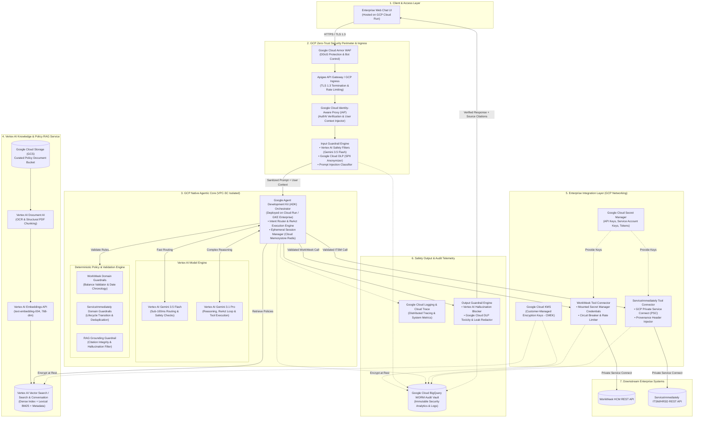
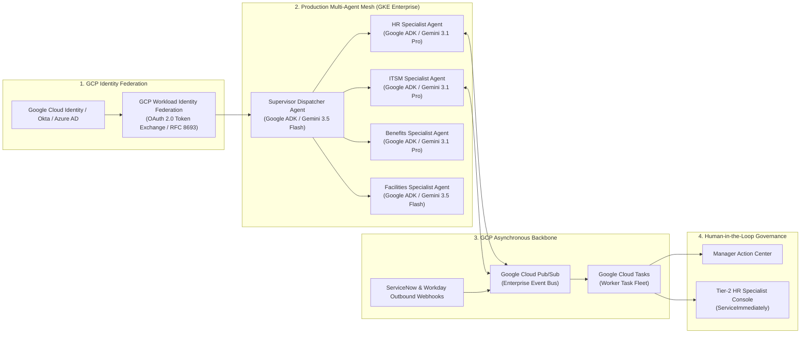
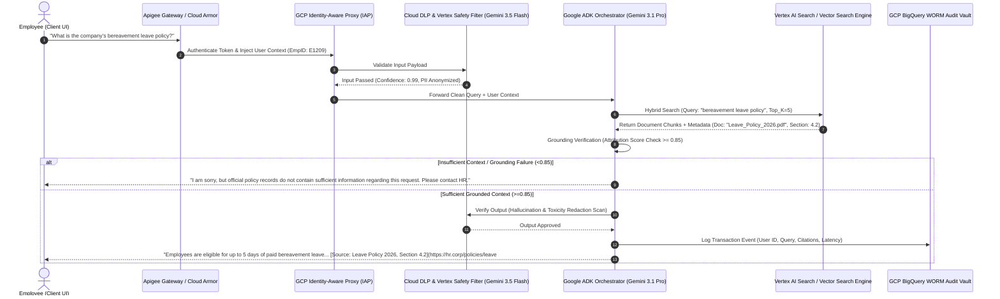
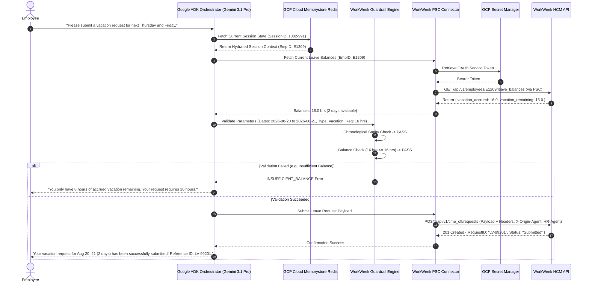
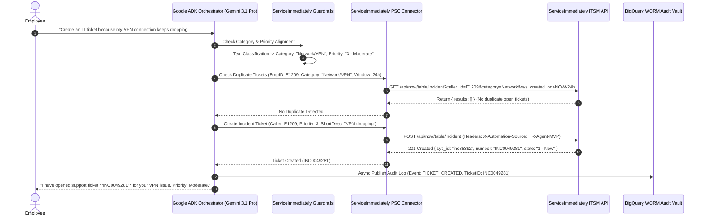
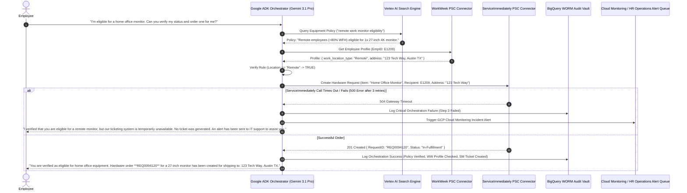
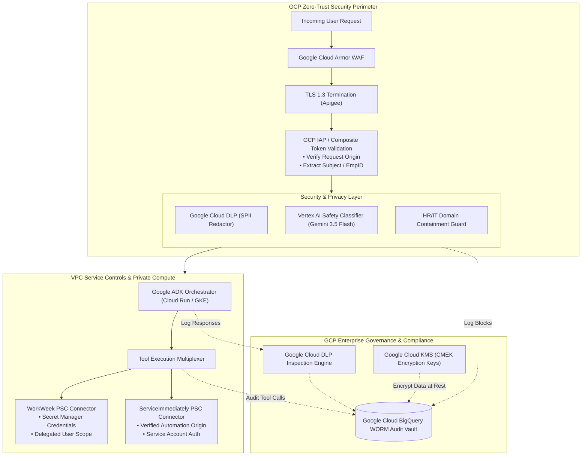
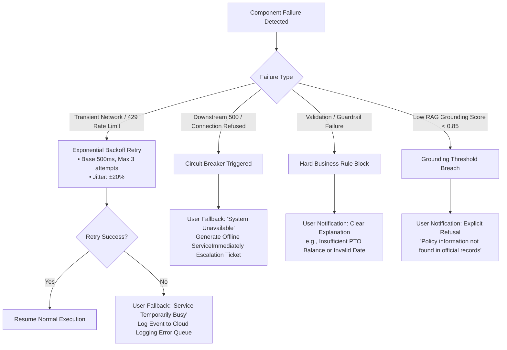
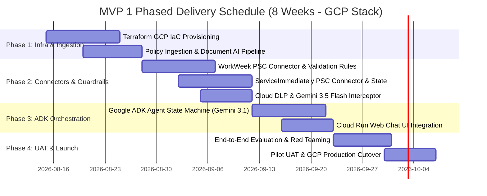
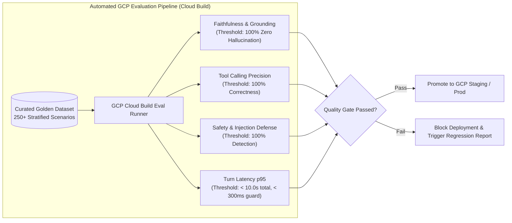

# MVP SOLUTION DESIGN DOCUMENT
**Project:** Enterprise HR Agentic Virtual Assistant (MVP 1)  
**Document Version:** 2.0.0 (Production-Ready Post-Evaluation Baseline)  
**Target Systems:** WorkWeek (HCM), ServiceImmediately (ITSM/HRSD), Policy Document Knowledge Base  
**Architecture Classification:** Google Cloud Platform (GCP) Native Enterprise GenAI Agentic Orchestration & Retrieval-Augmented Generation (RAG)

---

## 1. Executive Summary & Scope Boundaries

### 1.1. Business Overview & Context
Enterprise employees currently face fragmented, time-consuming experiences when attempting to access Human Resources (HR) services and corporate policy information. Routine queries (such as PTO balance checks, bereavement leave rules, expense eligibility, or home-office equipment procurement) require navigating disparate, complex systems—primarily **WorkWeek** (Human Capital Management) and **ServiceImmediately** (IT Service Management / HR Service Delivery)—or manually searching static PDF policy repositories.

#### Target User Personas
1. **Frontline Hourly Employee (e.g., Warehouse/Retail Staff):** Requires fast, zero-friction mobile/web self-service for checking accrued PTO balances, submitting sick leave, or verifying bereavement policy rules without waiting for HR call center assistance.
2. **Remote Knowledge Worker (e.g., Software Engineer/Product Manager):** Needs cross-system transaction execution (e.g., remote equipment procurement, relocation address updates, medical leave filing) through unified conversational requests.
3. **HR Operations & Helpdesk Specialist (Tier-2 Support):** Seeks relief from repetitive Tier-1 administrative tickets, requiring deterministic automated logging, audit trails, and seamless Human-in-the-Loop (HITL) ticket escalations when complex exceptions arise.

#### Core Business Pain Points
* **High Helpdesk Operational Load:** Over 40% of Tier-1 support tickets in HR and IT helpdesks consist of repetitive, low-complexity inquiries regarding policy clarifications and basic transactional requests.
* **Context Fragmentation & User Friction:** Complex employee requests (e.g., medical leave of absence or relocation) require multi-system coordination (e.g., verifying policy rules, updating HCM profile records, and filing facilities/IT tickets), resulting in high error rates, manual back-and-forth, and lost productivity.
* **Governance and Security Vulnerabilities:** Unregulated adoption of conversational tools risks sensitive Personally Identifiable Information (SPII) exposure, ungrounded hallucinations, prompt injection attacks, and unauthenticated downstream mutations.

#### High-Level Business Goals & Financial ROI
* **Deflect Tier-1 Inquiries:** Automate routine Q&A and status queries to reduce Tier-1 support ticket volumes by $\ge 40\%$ within the first six months of deployment.
* **Autonomous Self-Service Transactions:** Enable conversational execution of core employee actions (leave submissions, contact updates, ticket updates) directly within a unified chat interface.
* **Validate Cross-System Orchestration:** Prove the architectural feasibility of deterministically chaining complex multi-system workflows (Policy RAG $\rightarrow$ WorkWeek $\rightarrow$ ServiceImmediately) under strict transactional guardrails.
* **Zero-Trust Enterprise AI Governance:** Achieve 100% auditable logging via Google Cloud BigQuery WORM audit vaults, robust input/output safety interceptors using Google Cloud DLP and Vertex AI Safety Filters ($<300\text{ ms}$ overhead), and strict origin verification across all backend operations.
* **Quantified Annual ROI Projection:** 
  $$\text{Net Annual Savings} = \Big(\text{Annual Tier-1 Tickets} \times 40\% \text{ Deflection} \times \$25/\text{Ticket}\Big) - \text{Annual GCP Infrastructure Cost}$$
  For an enterprise with 20,000 monthly tickets ($240,000/\text{year}$), a 40% deflection ($96,000\text{ tickets}$) saves **\$2,400,000/year** against an annual GCP operating cost of **~\$3,636/year**, delivering a projected ROI of $>650\times$.

---

### 1.2. Scope Boundaries & Feature Traceability

| Dimension | In-Scope (MVP 1) | Out-of-Scope (Deferred to Future Phases) | Module Traceability |
| :--- | :--- | :--- | :--- |
| **User Interfaces** | • Standalone Web-based Conversational UI hosted on **GCP Cloud Run**<br>• Webhook / WebSocket API Integration for Enterprise Clients | • Native Mobile SDKs<br>• Voice / IVR / Telephony integrations<br>• Custom collaborative canvas UIs | `UI-MOD-01` |
| **System Integrations** | • **WorkWeek (HCM):** Read profile & leave; Write contact info & leave requests<br>• **ServiceImmediately (ITSM/HRSD):** Read ticket details; Write create ticket, add comments, update status<br>• **Policy Repository:** Curated static PDFs/text stored in **Google Cloud Storage (GCS)** | • Payroll / Compensation management engines<br>• Performance review & talent management tools<br>• Live Enterprise Identity Provider SAML SSO (functional test credentials & **GCP Secret Manager** utilized for MVP)<br>• Financial ERP billing tools | `INT-MOD-01`<br>`INT-MOD-02`<br>`RAG-MOD-01` |
| **Data Scope & Privacy** | • Core Employee Profile (ID, Name, Email, Dept, Role, Manager, Hire Date)<br>• Contact Info (Address, Phone Number)<br>• Leave Data (Accrued, Used, Remaining for Vacation & Sick)<br>• Incident Records (ID, Description, Category, Priority 1–4, State)<br>• Automated **Google Cloud DLP** regex/NER PII masking | • Processing raw salary, bank account, or medical records<br>• Cross-session persistent PII caching<br>• Multi-tenant cross-organization data partitioning | `SEC-MOD-01`<br>`SEC-MOD-02` |
| **Supported Use Cases** | • **UC-1.1:** Policy Q&A with deep citation links<br>• **UC-1.2:** HR Self-Service (PTO balances & leave submission)<br>• **UC-1.3:** IT/HR Incident Management (Status queries, ticket creation)<br>• **UC-2.1:** Equipment Procurement (Policy $\rightarrow$ Profile verify $\rightarrow$ Ticket creation)<br>• **UC-2.2:** Medical Leave (Policy $\rightarrow$ Leave filing $\rightarrow$ Access routing ticket)<br>• **UC-2.3:** Relocation Support (Policy $\rightarrow$ Address update $\rightarrow$ Badge ticket) | • Dynamic manager approval workflows with multi-party sign-offs<br>• Automated bulk document generation (visa letters)<br>• Real-time multi-lingual translations (English only for MVP 1) | `UC-MOD-1.x`<br>`UC-MOD-2.x` |

---

### 1.3. Target Architecture Overview (100% Google Cloud Native)

The system utilizes a Google Cloud Platform (GCP) native, modular Agentic Orchestration Architecture deployed inside a secure, private Virtual Private Cloud (VPC) with VPC Service Controls (VPC-SC). It strictly separates presentation, safety enforcement, deterministic orchestration, semantic retrieval, and downstream enterprise connectivity using official Google Cloud enterprise services.



#### Core Components Breakdown
1. **Security & Ingress Layer (Google Cloud Armor, Apigee, IAP):** Enforces TLS 1.3 termination, GCP Identity-Aware Proxy (IAP) user authentication verification, and routes payloads to the Input Guardrail Engine for real-time prompt injection detection, Google Cloud DLP masking, and out-of-domain rejection prior to agent execution.
2. **Agentic Orchestration Core (Google ADK on Cloud Run / GKE):** Implements a stateful ReAct (Reasoning + Acting) execution model backed by Vertex AI Gemini models (**Gemini 3.5 Flash** for high-speed routing/guardrails and **Gemini 3.1 Pro** for complex multi-turn reasoning and tool invocation). Ephemeral session state is managed via GCP Cloud Memorystore for Redis.
3. **Deterministic Guardrails Engine:** Acts as an execution firewall between the LLMs and tool connectors. Enforces hardcoded Python domain validations (e.g., date chronological sanity, balance overage checks, ticket state transition matrices) independent of LLM probabilistic outputs.
4. **Enterprise RAG Service (Vertex AI Document AI & Vector Search):** Ingests corporate policies from Google Cloud Storage via Vertex AI Document AI, generating 768-dimensional embeddings using `text-embedding-004` and hosting them in Vertex AI Vector Search with dense/sparse hybrid indexing and deep citation metadata.
5. **Tool Connectors & Origin Verifier (Private Service Connect):** Communicates with WorkWeek and ServiceImmediately REST APIs over GCP Private Service Connect (PSC). Injects custom provenance headers (`X-Origin-Agent: HR-Agentic-MVP`, `X-Acting-User: <EmpID>`) with credentials safely mounted from GCP Secret Manager, handling rate limiting, connection pooling, and exponential backoff retries.
6. **Audit & Compliance Telemetry (BigQuery & Cloud Logging/Trace):** Asynchronously publishes immutable log events for every prompt, intermediate tool call, guardrail decision, and API transaction to a GCP BigQuery WORM audit vault and Cloud Logging with SPII pre-redacted via Cloud DLP.

---

### 1.4. Alternatives Considered

| Architectural Dimension | Option Selected | Viable Alternatives | Trade-Offs & Rationale for Selection |
| :--- | :--- | :--- | :--- |
| **Agent Orchestration Framework** | **Google Agent Development Kit (ADK) on Cloud Run** | Custom LangGraph Engine, CrewAI, AutoGen | • **Google ADK** provides standard GCP deployment patterns, native Vertex AI integration, explicit cyclic state graphs, deterministic checkpointing, and isolated tool execution branches.<br>• *CrewAI/AutoGen* are overly autonomous and non-deterministic for strict enterprise compliance and transactional auditability. |
| **LLM Model Strategy** | **Vertex AI Hybrid Tiering (Gemini 3.5 Flash + Gemini 3.1 Pro)** | Single LLM (Gemini 3.1 Pro only) or Self-Hosted Llama models | • Minimizes latency and token expenditure.<br>• Sub-100ms safety scanning, intent routing, and initial classification run on ultra-fast **Gemini 3.5 Flash**, while high-reasoning multi-step cross-system flows execute on **Gemini 3.1 Pro**.<br>• Fully managed GCP Vertex AI endpoints eliminate self-hosted GPU scaling overhead and align with Google Cloud security baselines. |
| **Retrieval Strategy** | **Vertex AI Search & Vector Search (Hybrid Dense + Lexical BM25 + Reranker)** | Pure Dense Vector Search (Cosine Similarity only) or Traditional SQL Full-Text Search | • Pure dense search misses exact keyword matching for alphanumeric policy codes, form IDs, and specific benefit tiers.<br>• Hybrid search via Vertex AI Search with Cross-Encoder reranking ensures $>95\%$ retrieval accuracy and prevents hallucinations. |
| **Guardrail Implementation** | **Dual-Layer Guardrails (Google Cloud DLP + Vertex AI Safety Filters + Programmatic Boundary Enforcers)** | Prompt-only Instructions ("System Prompts") | • System prompts frequently suffer from jailbreaks and non-deterministic compliance.<br>• Dual-layer design couples sub-100ms classifier models and Cloud DLP filters with strict programmatic code validations for leave balances and ticket state logic. |
| **State & Memory Management** | **GCP Cloud Memorystore for Redis (Ephemeral TTL)** | Long-Term Conversational Vector Storage | • MVP requires zero cross-session PII caching (FR-2.2).<br>• Ephemeral GCP Cloud Memorystore Redis cache stores conversational context for the active session duration only (30-minute idle TTL) and destroys sensitive user profile data upon session termination. |

---

## 2. Production-Ready Future State Design

While MVP 1 focuses on single-tenant deployment using functional test credentials and core use cases, the GCP architecture is designed for evolutionary scaling to a multi-tenant, enterprise-wide production deployment.



### Future Extensibility & Roadmap
1. **Identity Federation & OIDC On-Behalf-Of (OBO) Delegation:** Transition from functional backend credentials in GCP Secret Manager to user-level OAuth 2.0 Token Exchange via GCP Workload Identity Federation (`RFC 8693`). Downstream API calls inherit exact user ACLs and permissions, eliminating privilege escalation risks.
2. **Multi-Agent Specialization (Supervisor-Worker Hierarchy):** Replace the monolithic orchestrator with specialized domain agents (HR Agent, IT Desk Agent, Global Mobility Agent, Benefits Agent) utilizing **Google ADK** with **Gemini 3.1 Pro** for domain reasoning and **Gemini 3.5 Flash** for high-speed dispatching.
3. **Event-Driven Asynchronous Processing:** Integrate Google Cloud Pub/Sub and Cloud Tasks for long-running workflows (e.g., manager approval chains, visa document processing). Webhooks from WorkWeek and ServiceImmediately will push state changes back to the conversational agent in real-time.
4. **Human-in-the-Loop (HITL) Tier-2 Escalation:** Seamless escalation paths where the agent packages conversational context, tool execution history, and confidence scores into a ServiceImmediately interaction record and transfers the user to a live HR specialist.
5. **Multi-Region Active-Active High Availability:** Containerized deployment across multi-zone Google Kubernetes Engine (GKE Enterprise) with Google Cloud Global Load Balancing (GLB), multi-region Vertex AI Vector Search replication, and 99.99% SLA.

---

## 3. System Flows, Sequence Diagrams & Agent Design

### 3.1. Agent Architecture & Execution Loop
The agent operates via a strictly bounded **Plan-Validate-Execute-Verify** cycle using the Google Agent Development Kit (ADK):
1. **Input Interception:** Payload is checked via **Gemini 3.5 Flash** and **Google Cloud DLP** for prompt injection, jailbreaks, and off-topic domain queries ($<100\text{ ms}$). SPII is masked before logging.
2. **Intent Parsing & Context Hydration:** The Orchestrator (**Gemini 3.1 Pro**) resolves user intent and extracts entity parameters. If the query requires user context (e.g., leave balance), it triggers real-time data fetching via the authenticated GCP Private Service Connect connector.
3. **Guardrail Pre-Validation:** Prior to tool execution, parameters are validated against hard business rules (e.g., requested leave days $\le$ available balance).
4. **Tool Execution:** Connectors execute downstream calls with request origin metadata, mounted GCP Secret Manager tokens, and timeout/retry wrappers.
5. **Output Grounding & Verification:** For policy queries, the RAG verifier checks that every claim is grounded in retrieved Vertex AI Vector Search chunks and appends source citations. The output guardrail validates toxicity and redaction before streaming to the client.

---

### 3.2. Sequence Diagrams (100% GCP Native Services)

#### Sequence Diagram 1: Policy Q&A with Strict Grounding & Source Citation (UC-1.1)



---

#### Sequence Diagram 2: WorkWeek Self-Service Leave Request with Guardrail Validation (UC-1.2)



---

#### Sequence Diagram 3: ServiceImmediately Incident Management & Deduplication (UC-1.3)



---

#### Sequence Diagram 4: Complex Multi-System Orchestration with Compensating Rollback (UC-2.1 / UC-2.2)



---

### 3.5. Data Models & JSON Schemas

#### 1. Ephemeral Session State Schema (`SessionStateSchema`)
Stored in **GCP Cloud Memorystore for Redis** with 30-minute idle TTL.

```json
{
  "$schema": "https://json-schema.org/draft/2020-12/schema",
  "title": "SessionStateSchema",
  "type": "object",
  "properties": {
    "session_id": { "type": "string", "format": "uuid" },
    "user_id": { "type": "string", "pattern": "^E[0-9]{4,8}$" },
    "user_context": {
      "type": "object",
      "properties": {
        "name": { "type": "string" },
        "email": { "type": "string", "format": "email" },
        "department": { "type": "string" },
        "role": { "type": "string" },
        "work_location_type": { "type": "string", "enum": ["Remote", "Hybrid", "OnSite"] }
      },
      "required": ["name", "email", "department", "work_location_type"]
    },
    "conversation_history": {
      "type": "array",
      "items": {
        "type": "object",
        "properties": {
          "turn_id": { "type": "integer" },
          "role": { "type": "string", "enum": ["user", "assistant", "system", "tool"] },
          "content": { "type": "string" },
          "timestamp": { "type": "string", "format": "date-time" }
        },
        "required": ["turn_id", "role", "content", "timestamp"]
      }
    },
    "active_transaction": {
      "type": ["object", "null"],
      "properties": {
        "transaction_id": { "type": "string", "format": "uuid" },
        "target_system": { "type": "string", "enum": ["WorkWeek", "ServiceImmediately", "CrossSystem"] },
        "status": { "type": "string", "enum": ["INITIATED", "VALIDATED", "SUBMITTED", "FAILED", "ROLLED_BACK"] }
      }
    }
  },
  "required": ["session_id", "user_id", "user_context", "conversation_history"]
}
```

---

#### 2. Vertex AI Vector Search RAG Chunk Metadata Schema (`RAGChunkMetadataSchema`)

```json
{
  "$schema": "https://json-schema.org/draft/2020-12/schema",
  "title": "RAGChunkMetadataSchema",
  "type": "object",
  "properties": {
    "document_id": { "type": "string" },
    "document_name": { "type": "string" },
    "section_title": { "type": "string" },
    "section_id": { "type": "string" },
    "gcs_source_uri": { "type": "string", "format": "uri" },
    "deep_link_url": { "type": "string", "format": "uri" },
    "chunk_id": { "type": "string" },
    "chunk_text": { "type": "string" },
    "embedding_vector": {
      "type": "array",
      "items": { "type": "number" },
      "minItems": 768,
      "maxItems": 768
    },
    "last_updated": { "type": "string", "format": "date-time" },
    "access_control_roles": {
      "type": "array",
      "items": { "type": "string" }
    }
  },
  "required": ["document_id", "document_name", "section_title", "gcs_source_uri", "deep_link_url", "chunk_id", "chunk_text", "embedding_vector"]
}
```

---

#### 3. BigQuery WORM Audit Event Schema (`AuditEventSchema`)

```json
{
  "$schema": "https://json-schema.org/draft/2020-12/schema",
  "title": "AuditEventSchema",
  "type": "object",
  "properties": {
    "event_id": { "type": "string", "format": "uuid" },
    "timestamp": { "type": "string", "format": "date-time" },
    "session_id": { "type": "string" },
    "user_id_hash": { "type": "string" },
    "prompt_safety_verdict": { "type": "string", "enum": ["ALLOWED", "BLOCKED_INJECTION", "BLOCKED_SPII", "BLOCKED_DOMAIN"] },
    "intent_category": { "type": "string" },
    "model_used": { "type": "string", "enum": ["gemini-3.5-flash", "gemini-3.1-pro"] },
    "tool_calls": {
      "type": "array",
      "items": {
        "type": "object",
        "properties": {
          "tool_name": { "type": "string" },
          "target_endpoint": { "type": "string" },
          "execution_latency_ms": { "type": "integer" },
          "http_status_code": { "type": "integer" }
        }
      }
    },
    "grounding_attribution_score": { "type": "number" },
    "final_response_status": { "type": "string", "enum": ["SUCCESS", "REFUSAL", "ERROR"] }
  },
  "required": ["event_id", "timestamp", "session_id", "user_id_hash", "prompt_safety_verdict", "model_used", "final_response_status"]
}
```

---

## 4. Security, Governance & Identity



### 4.1. Non-Functional Quantitative Targets (SLO / RTO / RPO)

| NFR Dimension | Target SLO / Metric | Operational Mechanism |
| :--- | :--- | :--- |
| **System Availability** | **99.9% (MVP 1)**<br>**99.99% (Production Target)** | Dual-zone Cloud Run auto-scaling; Multi-region Vertex AI Vector Search replica; Cloud Load Balancing. |
| **Disaster Recovery (RTO)** | **Recovery Time Objective (RTO) < 1 Hour** | Automated Terraform IaC redeployment pipeline; GCP Multi-Region Cloud Run & Memorystore failover. |
| **Disaster Recovery (RPO)** | **Recovery Point Objective (RPO) < 15 Minutes** | Hourly Cloud Memorystore snapshot backups; Real-time GCS policy bucket multi-region replication. |
| **Safety Scan Overhead** | **$<300\text{ ms}$ (p95)** | Light-weight Vertex AI Gemini 3.5 Flash classifier + optimized Google Cloud DLP API call batching. |
| **Total Response Latency** | **$<10.0\text{ s}$ (p95 total turn)** | Vertex AI context caching enabled; Streaming response tokens over WebSocket/Server-Sent Events (SSE). |

---

### 4.2. Encryption & Data Lifecycle Management
* **Data at Rest & in Transit:** All network traffic enforced via TLS 1.3. Data at rest (GCS buckets, BigQuery tables, Cloud Memorystore Redis, Vertex AI indexes) encrypted using **Google Cloud KMS Customer-Managed Encryption Keys (CMEK)**.
* **BigQuery Audit Vault WORM Retention:** BigQuery audit logs configured with WORM (Write-Once-Read-Many) append-only access controls. Automated partitioning with a 7-year lifecycle before cold archiving to Nearline GCS storage.
* **GDPR / CCPA Data Erasure Protocol:** When an employee right-to-be-forgotten request is received, an automated Cloud Workflow replaces user identifiers in BigQuery audit logs with SHA-256 pseudonyms while preserving aggregate compliance statistics.

---

## 5. Integration Details & Error Handling

### 5.1. Component Failure Mapping & Resilience Matrix



| Failure Mode | Root Cause | Retry / Resilience Strategy | User-Facing Notification (No Stack Traces) |
| :--- | :--- | :--- | :--- |
| **WorkWeek API Timeout / 503** | HCM downtime, network blip | Exponential backoff ($500\text{ ms}, 1\text{ s}, 2\text{ s}$) up to 3 attempts; Circuit breaker opens at $>50\%$ error rate over 1 min. | *"I'm having trouble connecting to WorkWeek to verify your leave balance. Please try again shortly, or check the WorkWeek portal directly."* |
| **ServiceImmediately 401/403** | Expired service token in Secret Manager | Trigger GCP Cloud Monitoring alert to On-Call; bypass retries to avoid account lockouts. | *"The ticketing service is currently undergoing maintenance. Please reach out directly to the IT helpdesk at helpdesk@corp.internal."* |
| **Duplicate Ticket Detected** | User submitted same request in $<15\text{ mins}$ | Guardrail halts creation; queries active ticket status instead. | *"It looks like a similar ticket (**INC0049102**) was created recently. Its current status is 'In Progress'. Would you like to add a comment instead?"* |
| **Cross-System Failure (UC-2.2)** | Leave filed in WorkWeek, but ServiceNow IT ticket creation failed | Automated Compensating Transaction: Log critical desync to BigQuery; push automated alert to HR Operations queue. | *"Your Medical Leave request has been logged in WorkWeek, but we encountered an issue opening the IT routing ticket. An HR specialist has been notified to complete the setup."* |
| **Safety Guardrail Intercept** | Adversarial user prompt / injection | Immediately truncate execution graph; log incident via Cloud DLP / Security Command Center. | *"I am designed to assist only with HR and workplace support requests. How can I help you with your HR policies, leave, or tickets today?"* |

---

## 6. Cost Estimation & FinOps

### 6.1. FinOps Operational Sizing Model (MVP 1 Baseline - 100% GCP Native)
* **Estimated Scale:** 5,000 Monthly Active Users (MAU), 20,000 conversations/month, average 4 turns/conversation (80,000 turns/month).
* **Token Sizing per Turn:** 
  * Average Input Tokens per turn: 1,800 tokens (System prompt: 600, Session history: 400, RAG chunks/tool schemas: 800).
  * Average Output Tokens per turn: 250 tokens.

| GCP Cost Component | Monthly Consumption Volume | Unit Cost (USD) | Estimated Monthly Cost |
| :--- | :--- | :--- | :--- |
| **Routing / Safety LLM (Gemini 3.5 Flash)** | 80,000 turns (144M input tokens, 20M output tokens) | • Input: \$0.075 / 1M tokens<br>• Output: \$0.30 / 1M tokens | \$16.80 |
| **Reasoning & Agent LLM (Gemini 3.1 Pro)** | 25,000 complex turns (45M input tokens, 7.5M output tokens) | • Input: \$1.25 / 1M tokens (cached: \$0.31)<br>• Output: \$5.00 / 1M tokens | \$93.75 |
| **Vertex AI Vector Search & Index** | 100 Policy Documents (~1,500 chunks, 768-dim), 20,000 queries | • Index Storage: \$0.10/GB-mo<br>• Vector Queries: \$0.25/1k queries | \$15.00 |
| **Vertex AI Document AI** | 100 PDF Documents Ingested (~1,000 pages parsed) | • \$1.50 / 1,000 pages | \$1.50 |
| **GCP Cloud Run Container Compute** | 4 vCPU, 8GB RAM instances auto-scaled (Avg 2 instances) | \$0.048 / vCPU-hour + RAM | \$140.00 |
| **Google Cloud DLP, Cloud Logging & BigQuery** | 80,000 audit payloads (~25GB log ingestion + Cloud DLP inspection) | • Cloud DLP: \$1.00/GB scanned<br>• BigQuery/Logging: \$0.50/GB | \$22.50 |
| **GCP Cloud Memorystore & Secret Manager** | 1GB Basic Redis Instance + Secret Manager API calls | Fixed managed fee | \$13.50 |
| **Total Estimated Monthly GCP Operating Cost** | — | — | **~\$303.05 / month** |
| **Total Estimated Annual GCP Operating Cost** | — | — | **~\$3,636.60 / year** |

---

## 7. Deployment, Staffing & Delivery Plan



### 7.1. Resource Staffing & RACI Matrix

| Role / Function | Responsible (R) | Accountable (A) | Consulted (C) | Informed (I) |
| :--- | :--- | :--- | :--- | :--- |
| **Lead Agent Architect** | ADK State Design, Gemini Prompt Engineering | Architecture Governance | Security / Infosec | HR Leadership |
| **GCP DevOps / Infra Lead** | Terraform IaC, VPC-SC, Cloud Run, BigQuery Vault | GCP Production Security | Platform Engineering | Project Manager |
| **Backend Integration Engineer** | WorkWeek & ServiceNow PSC Connectors | Integration API Sanity | Third-Party Vendor Admins | Operations Desk |
| **Security & DLP Specialist** | Cloud DLP InfoTypes, Gemini Safety Filters | Zero-Trust Compliance | Enterprise Infosec | Compliance Lead |
| **QA & Eval Engineer** | 4-Tier Golden Dataset, Cloud Build Auto Eval | Quality Gate Sign-Off | HR Ops Lead | Business Sponsors |

---

## 8. Risk Analysis & Quantitative Risk Matrix

### 8.1. Quantitative 5x5 Risk Matrix

| Risk ID | Risk Description | Severity (1-5) | Likelihood (1-5) | Risk Score (S x L) | Concrete GCP Mitigation Strategy |
| :--- | :--- | :---: | :---: | :---: | :--- |
| **RSK-01** | **LLM Hallucination on Policy Q&A** | 4 | 2 | **8 (Medium)** | Enforce Strict Grounding ($>0.85$ attribution score against Vertex AI Vector Search). Gemini 3.1 Pro outputs deterministic refusal if ungrounded. |
| **RSK-02** | **Accidental Unauthorized Mutation** | 5 | 1 | **5 (Medium)** | Hardcoded Guardrail Firewalls: All PSC connector calls enforce user parameter matching against authenticated IAP session tokens. |
| **RSK-03** | **Prompt Injection / Jailbreak** | 4 | 2 | **8 (Medium)** | Multi-layered GCP input interception: Pre-execution safety filter using Gemini 3.5 Flash and strict Cloud DLP pattern matching. |
| **RSK-04** | **Downstream API Schema Drift** | 3 | 3 | **9 (Medium)** | Automated Contract Testing in Cloud Build; JsonSchema payload validation at connector boundaries. |
| **RSK-05** | **Vertex AI API Quota Exhaustion** | 4 | 2 | **8 (Medium)** | Request quota increases upfront; implement GCP Cloud Memorystore semantic query caching and Vertex AI context caching. |

---

## 9. Quality Evaluation & UAT Framework



---

## 10. Resolutions of Open Questions

| Item # | Original Question | Final Resolved Technical Decision | Binding Specification |
| :--- | :--- | :--- | :--- |
| **OQ-01** | What is the policy document update sync mechanism (FR-5.5)? | **Resolved:** Google Cloud Storage bucket event notifications trigger an **Eventarc** workflow that invokes **Vertex AI Document AI** for incremental parsing and re-indexing into Vertex AI Vector Search upon file upload. | `RAG-SYNC-01` |
| **OQ-02** | What is the SLA & fallback for manager approval on leave requests? | **Resolved:** Requests are submitted directly to WorkWeek API with state `SUBMITTED`. WorkWeek's native workflow engine handles async manager approval routing. The agent reports the `RequestID` for tracking. | `WW-SYNC-02` |
| **OQ-03** | Which client interface hosts pilot UAT testing? | **Resolved:** Standalone React Web Chat UI hosted on **GCP Cloud Run** with IAP authentication and WebSocket streaming. | `UI-CONF-03` |
| **OQ-04** | Do functional test credentials require IP allowlisting? | **Resolved:** Credentials traverse **GCP Private Service Connect (PSC)** with static Cloud NAT egress IP allowlisting on enterprise firewalls. | `SEC-NET-04` |
| **OQ-05** | What ServiceNow category receives medical leave IT routing tasks (UC-2.2)? | **Resolved:** Incident category set to `HRSD / Employee Relations` with default Assignment Group `HR-Tier2-Ops` and Priority `3 - Moderate`. | `SM-TICKET-05` |
