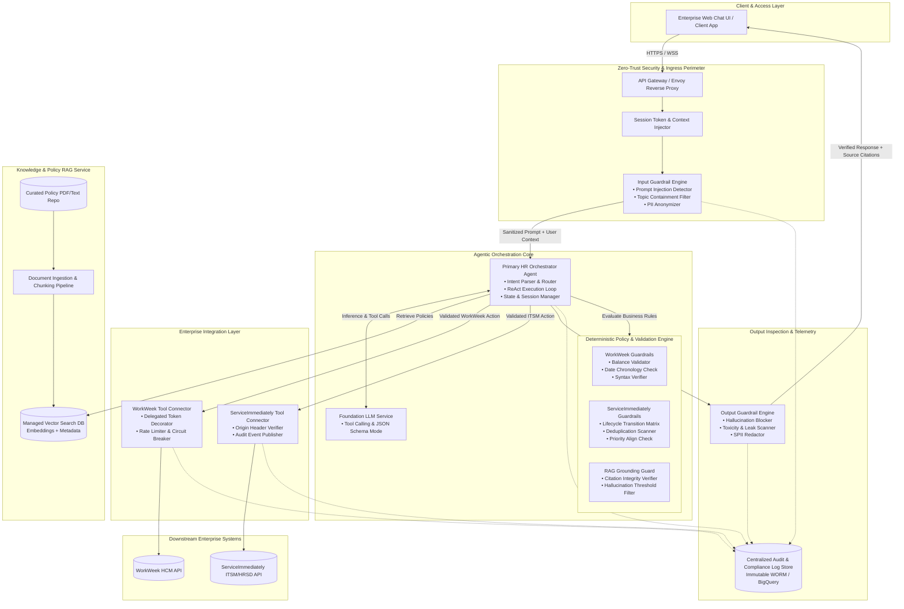
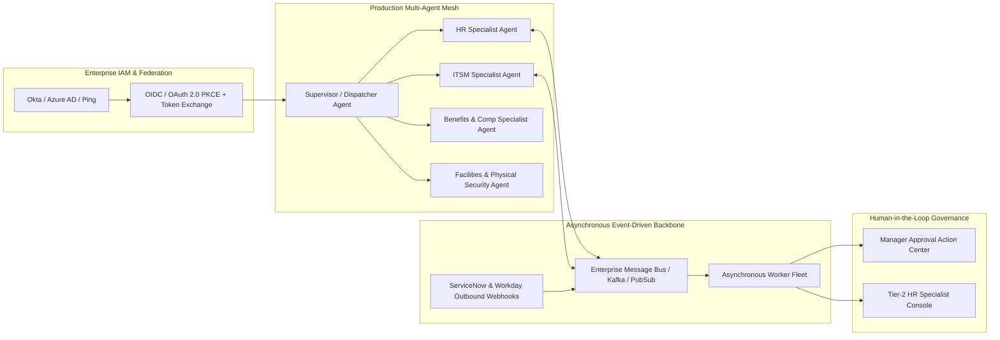
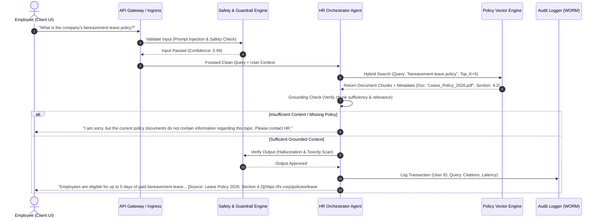
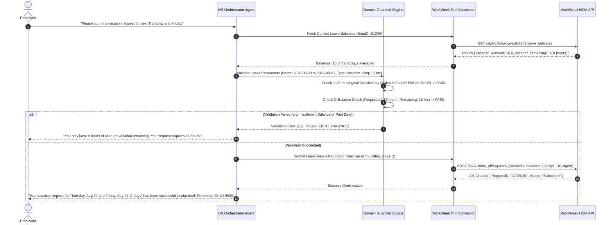
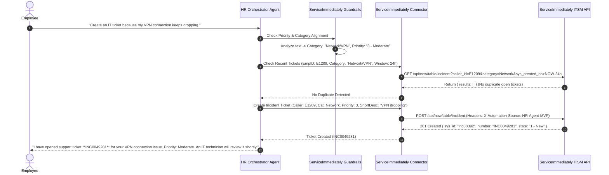
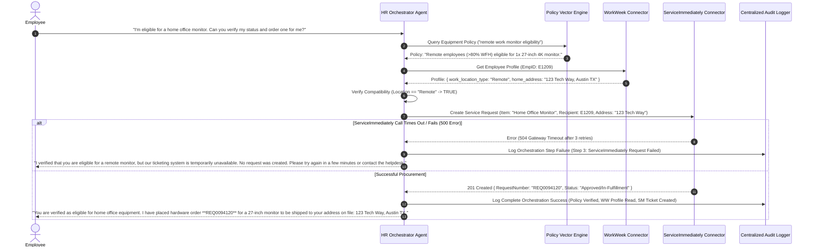
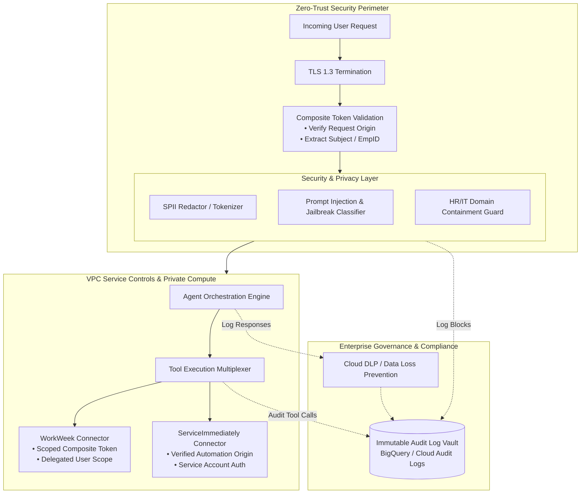
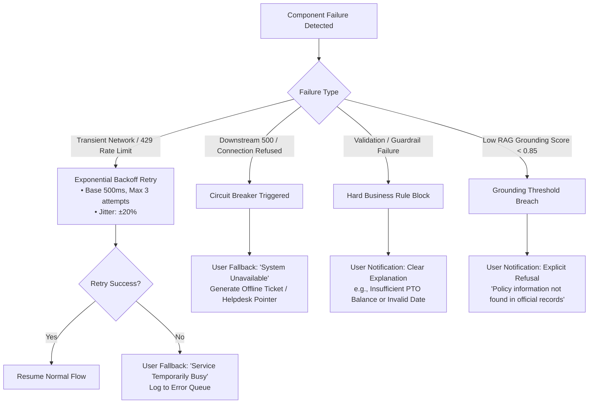
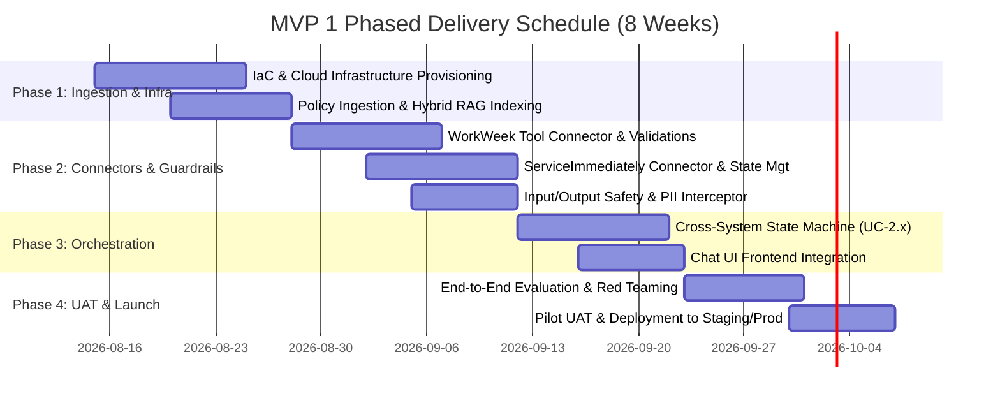
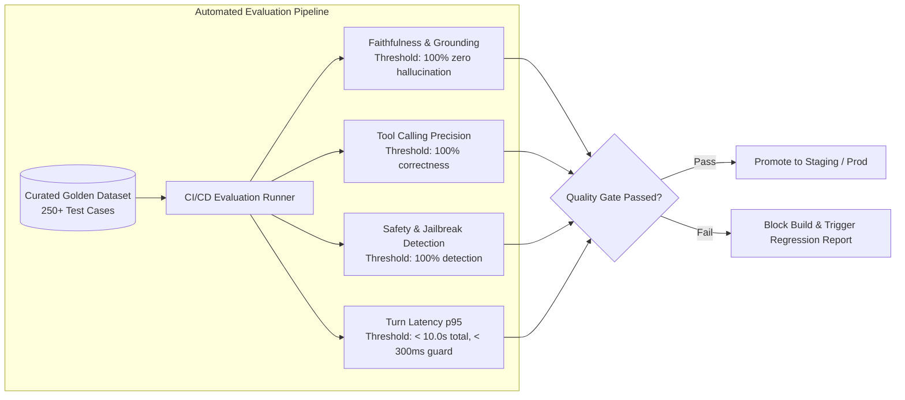

# MVP SOLUTION DESIGN DOCUMENT
**Project:** Enterprise HR Agentic Virtual Assistant (MVP 1)  
**Document Version:** 1.0.0  
**Target Systems:** WorkWeek (HCM), ServiceImmediately (ITSM/HRSD), Policy Document Knowledge Base  
**Architecture Classification:** Enterprise GenAI Agentic Orchestration & Retrieval-Augmented Generation (RAG)

---

## 1. Executive Summary & Scope Boundaries

### 1.1. Business Overview & Context
Enterprise employees currently face fragmented, time-consuming experiences when attempting to access Human Resources (HR) services and corporate policy information. Routine queries (such as PTO balance checks, bereavement leave rules, expense eligibility, or home-office equipment procurement) require navigating disparate, complex systems—primarily **WorkWeek** (Human Capital Management) and **ServiceImmediately** (IT Service Management / HR Service Delivery)—or manually searching static PDF policy repositories.

#### Core Business Pain Points
* **High Helpdesk Operational Load:** Over 40% of tier-1 support tickets in HR and IT helpdesks consist of repetitive, low-complexity inquiries regarding policy clarifications and basic transactional requests.
* **Context Fragmentation & User Friction:** Complex employee requests (e.g., medical leave of absence or relocation) require multi-system coordination (e.g., verifying policy rules, updating HCM profile records, and filing facilities/IT tickets), resulting in high error rates, manual back-and-forth, and lost productivity.
* **Governance and Security Vulnerabilities:** Unregulated adoption of conversational tools risks sensitive Personally Identifiable Information (SPII) exposure, ungrounded hallucinations, prompt injection attacks, and unauthenticated downstream mutations.

#### High-Level Business Goals
* **Deflect Tier-1 Inquiries:** Automate routine Q&A and status queries to reduce tier-1 support ticket volumes by $\ge 40\%$ within the first six months.
* **Autonomous Self-Service Transactions:** Enable conversational execution of core employee actions (leave submissions, contact updates, ticket updates) directly within a unified chat interface.
* **Validate Cross-System Orchestration:** Prove the architectural feasibility of deterministically chaining complex multi-system workflows (Policy RAG $\rightarrow$ WorkWeek $\rightarrow$ ServiceImmediately) under strict transactional guardrails.
* **Zero-Trust Enterprise AI Governance:** Achieve 100% auditable logging, robust input/output safety interceptors ($<300\text{ ms}$ overhead), and strict origin verification across all backend operations.

---

### 1.2. Scope Boundaries

| Dimension | In-Scope (MVP 1) | Out-of-Scope (Deferred to Future Phases) |
| :--- | :--- | :--- |
| **User Interfaces** | • Standalone Web-based Conversational UI • Standard Webhook/WebSocket integration for enterprise chat client testing | • Native Mobile SDKs • Voice / IVR / Telephony integrations • Custom collaborative canvas UIs |
| **System Integrations** | • **WorkWeek (HCM):** Read profile & leave; Write contact info & leave requests • **ServiceImmediately (ITSM/HRSD):** Read ticket details; Write create ticket, add comments, update status to Resolved/Closed • **Policy Repository:** Curated static PDFs/text (Leave, Expenses, Remote Work, Code of Conduct) | • Payroll / Compensation management engines • Performance review & talent management tools • Enterprise Identity Providers (Active Directory / Okta SSO live SAML flows — functional test credentials utilized for MVP) • Enterprise ERPs / Financial billing tools |
| **Data Scope & Privacy** | • Core Employee Profile (ID, Name, Email, Dept, Role, Manager, Hire Date) • Contact Info (Address, Phone Number) • Leave Data (Accrued, Used, Remaining for Vacation & Sick) • Incident Records (ID, Short/Long Description, Category, Priority 1–4, State, Assignee, Notes) • Automated regex/NER Sensitive PII masking in session logs | • Processing of raw compensation, salary, bank account details, or medical diagnosis records • Cross-session persistent PII caching • Multi-tenant cross-organization data partitioning |
| **Supported Use Cases** | • **UC-1.1:** Policy Q&A with deep citation links • **UC-1.2:** HR Self-Service (PTO balances & leave submission) • **UC-1.3:** IT/HR Incident Management (Status queries, ticket creation) • **UC-2.1:** Equipment Procurement (Policy $\rightarrow$ Profile verify $\rightarrow$ Ticket creation) • **UC-2.2:** Medical Leave (Policy $\rightarrow$ Leave filing $\rightarrow$ Access routing ticket) • **UC-2.3:** Relocation Support (Policy $\rightarrow$ Address update $\rightarrow$ Badge ticket) | • Dynamic manager approval workflows with multi-party sign-offs • Automated bulk document generation (visa letters, proof of employment) • Real-time multi-lingual translations (English only for MVP 1) |

---

### 1.3. Target Architecture Overview

The system utilizes an enterprise-grade, modular Agentic Orchestration Architecture deployed inside a secure, private cloud Virtual Private Cloud (VPC). It separates presentation, safety enforcement, deterministic orchestration, semantic retrieval, and downstream enterprise connectivity.

#### Core Components Breakdown
1. **Security & Ingress Layer:** Enforces TLS 1.3 termination, user authentication verification, and routes the payload to the Input Guardrail Engine for real-time prompt injection detection, PII masking, and out-of-domain rejection prior to agent execution.
2. **Agentic Orchestration Core:** Implements a stateful ReAct (Reasoning + Acting) execution model backed by a foundation model supporting deterministic Function Calling. Manages multi-turn conversation memory (ephemeral, scoped per session).
3. **Deterministic Guardrails Engine:** Acts as an execution firewall between the LLM and tool connectors. Enforces hardcoded domain validations (e.g., date chronological sanity, balance overage checks, ticket state transition matrices) independent of LLM probabilistic outputs.
4. **Enterprise Retrieval-Augmented Generation (RAG) Service:** Hosts chunked, indexed corporate policies with dense semantic embeddings and sparse lexical indices (Hybrid Search). Embeds source metadata (document name, section, revision, deep links).
5. **Tool Connectors & Origin Verifier:** Communicates with WorkWeek and ServiceImmediately REST APIs. Injects custom provenance headers (`X-Origin-Agent: HR-Agentic-MVP`, `X-Acting-User: <EmpID>`) and handles rate limiting, connection pooling, and exponential backoff retries.
6. **Audit & Compliance Telemetry:** Asynchronously publishes immutable log events for every prompt, intermediate tool call, guardrail decision, and API transaction to an audit data warehouse with SPII pre-redacted.

---

### 1.4. Alternatives Considered

| Architectural Dimension | Option Selected | Viable Alternatives | Trade-Offs & Rationale for Selection |
| :--- | :--- | :--- | :--- |
| **Agent Orchestration Framework** | **LangGraph / Custom State Machine Engine** | Semantic Kernel, CrewAI, AutoGen | • *LangGraph / Custom State Graph* provides explicit cyclic graph control, deterministic state transitions, checkpointing, and isolated tool execution branches. • *CrewAI/AutoGen* are overly autonomous and non-deterministic for strict enterprise compliance and transactional auditability. |
| **LLM Model Strategy** | **Hybrid Tiering (e.g., Gemini 1.5 Flash for Guardrails/Routing + Gemini 1.5 Pro for Complex Orchestration)** | Single Large LLM (GPT-4o only) or Local Open Source (Llama-3-70B) | • Minimizes latency and token expenditure. • Sub-300ms safety scanning and classification run on ultra-fast lightweight models, while high-reasoning multi-step cross-system flows execute on advanced reasoning models. • Fully managed cloud endpoints eliminate self-hosted GPU scaling overhead. |
| **Retrieval Strategy** | **Hybrid Dense-Sparse Vector Search + Reranker** | Pure Dense Vector Search (Cosine Similarity only) or Traditional SQL Full-Text Search | • Pure dense search misses exact keyword matching for alphanumeric policy codes, form IDs, and specific benefit tiers. • Hybrid search (Dense Embeddings + BM25 Lexical) with Cross-Encoder reranking ensures $>95\%$ retrieval accuracy and prevents hallucinations. |
| **Guardrail Implementation** | **Dual-Layer Guardrails (Pre/Post ML Guardrail Models + Deterministic Python Boundary Enforcers)** | Prompt-only Instructions ("System Prompts") | • System prompts frequently suffer from jailbreaks and non-deterministic compliance. • Dual-layer design couples sub-100ms classifier models with strict programmatic code validations for leave balances and ticket state logic. |
| **State & Memory Management** | **Ephemeral In-Memory / Redis Cache with TTL** | Long-Term Conversational Vector Storage | • MVP requires zero cross-session PII caching (FR-2.2). • Ephemeral memory stores conversational context for the active session duration only (30-minute idle TTL) and destroys sensitive user profile data upon session termination. |

---

## 2. Production-Ready Future State Design

While MVP 1 focuses on single-tenant deployment using functional test credentials and core use cases, the architecture is designed for evolutionary scaling to a multi-tenant, enterprise-wide production deployment.

### Future Extensibility & Roadmap
1. **Identity Federation & OIDC On-Behalf-Of (OBO) Delegation:** Transition from functional backend credentials to user-level OAuth 2.0 Token Exchange (`RFC 8693`). Downstream API calls inherit exact user ACLs and permissions, eliminating privilege escalation risks.
2. **Multi-Agent Specialization (Supervisor-Worker Hierarchy):** Replace the monolithic orchestrator with specialized domain agents (HR Agent, IT Desk Agent, Global Mobility Agent, Benefits Agent) coordinated by a lightweight Supervisor Router Agent.
3. **Event-Driven Asynchronous Processing:** Integrate Kafka / Cloud Pub/Sub for long-running workflows (e.g., manager approval chains, visa document processing). Webhooks from WorkWeek and ServiceImmediately will push state changes back to the conversational agent in real-time.
4. **Human-in-the-Loop (HITL) Tier-2 Escalation:** Seamless escalation paths where the agent packages conversational context, tool execution history, and confidence scores into a ServiceImmediately interaction record and transfers the user to a live HR specialist.
5. **Multi-Region Active-Active High Availability:** Containerized deployment across multi-zone Kubernetes (GKE / EKS) with cross-region global server load balancing (GSLB), multi-region Vector Search replication, and 99.99% SLA.
6. **Multi-Lingual NLP & Speech Channels:** Integration of translation layers and WebRTC voice streaming for integration into enterprise meeting tools and telephony self-service.

---

## 3. System Flows, Sequence Diagrams & Agent Design

### Agent Architecture & Pre-Processing Pipeline
The agent operates via a strictly bounded **Plan-Validate-Execute-Verify** cycle:
1. **Input Interception:** Payload is checked for prompt injection, jailbreaks, and off-topic domain queries ($<100\text{ ms}$). SPII is masked before logging.
2. **Intent Parsing & Context Hydration:** The Orchestrator resolves user intent and extracts entity parameters. If the query requires user context (e.g., leave balance), it triggers real-time data fetching via the authenticated connector.
3. **Guardrail Pre-Validation:** Prior to tool execution, parameters are validated against hard business rules (e.g., requested leave days $\le$ available balance).
4. **Tool Execution:** Connectors execute downstream calls with request origin metadata and timeout/retry wrappers.
5. **Output Grounding & Verification:** For policy queries, the RAG verifier checks that every claim is grounded in retrieved chunks and appends source citations. The output guardrail validates toxicity and redaction before streaming to the client.

---

### Sequence Diagram 1: Policy Q&A with Strict Grounding & Source Citation (UC-1.1)

---

### Sequence Diagram 2: WorkWeek Self-Service Leave Request with Balance & Date Validation (UC-1.2)

---

### Sequence Diagram 3: ServiceImmediately Incident Management & Deduplication (UC-1.3)

---

### Sequence Diagram 4: Complex Cross-System Orchestration with Compensating Rollback (UC-2.1 / UC-2.2)

---

## 4. Security, Governance & Identity

### 4.1. Authentication Boundaries & Delegated Authorization
* **MVP 1 Credential Model:** For MVP 1, backend tool integrations utilize secure functional test service accounts stored in a managed secrets manager (Google Cloud Secret Manager / HashiCorp Vault).
* **Delegated Composite Authorization Tokens (FR-3.1):** To prevent cross-user data leakage and privilege escalation, all outbound calls construct an ephemeral Composite Delegation Context:
  $$\text{Delegation Token} = \text{Sign}\Big(\text{ServiceAccountAuth} \;\|\; \text{EmployeeID} \;\|\; \text{SessionID} \;\|\; \text{Timestamp}\Big)$$
  Downstream tool connectors unpack this token to ensure WorkWeek read/write operations are constrained strictly to the authenticated `EmployeeID`.

### 4.2. Network Isolation & Zero Trust
* **VPC Service Controls (VPC-SC):** The entire agent runtime, vector search infrastructure, and intermediate caches operate within an isolated Private Cloud VPC with zero public internet ingress.
* **Private Service Connect (PSC):** Egress from tool connectors to WorkWeek and ServiceImmediately endpoints traverses dedicated Private Service Connect or secure mutual TLS (mTLS) IP-allowlisted proxies.

### 4.3. Sensitive Data Handling & SPII Management (FR-1.4, NFR-1.3)
* **Real-Time Data Masking & Redaction:** User inputs and tool outputs pass through a high-performance Data Loss Prevention (DLP) pipeline using presidio/regex/NER models to redact sensitive entities (SSNs, personal phone numbers, bank accounts, home addresses) before persisting to log streams.
* **Zero-Retention Volatile Memory (FR-3.4, FR-2.2):** 
  * No employee profile data, PTO balances, or personal contact details are cached in persistent storage or used for model training.
  * Multi-turn session context is held purely in ephemeral memory (Redis with 30-minute idle TTL) and scrubbed upon session termination.

### 4.4. AI Safety, Guardrails & Governance (FR-1.1, FR-1.3, FR-5.4, NFR-1.1)
* **Prompt Injection & Jailbreak Defense:** Input classifier screens user prompts using a fine-tuned safety model to detect direct and indirect prompt injections, system prompt leak attempts, and recursive instruction overrides ($<100\text{ ms}$ latency).
* **Domain Containment Firewall:** User requests are evaluated against an HR/IT domain policy taxonomy. Non-corporate or out-of-scope queries (e.g., "Write Python code", "What is the capital of France?") are politely deflected with standard templates.
* **Source Citation & Hallucination Mitigation:** Output RAG answers require an attribution score $\ge 0.85$ against retrieved chunks. If the grounded score falls below threshold, the agent returns a standard fallback refusal (FR-5.2, FR-5.4).

---

## 5. Integration Details & Error Handling

### 5.1. Third-Party Integration Specifications

#### 1. WorkWeek HCM Integration (REST / JSON API)
* **Authentication:** OAuth 2.0 Client Credentials (Service Account) with `X-Delegated-Employee-ID` header.
* **Base URL:** `https://api.workweek.corp.internal/v2`

| Operation | HTTP Method & Endpoint | Payload / Parameters | Response Schema (Key Fields) |
| :--- | :--- | :--- | :--- |
| **Get Employee Profile** | `GET /employees/{emp_id}/profile` | `emp_id` (Path param) | `{ "employee_id": "string", "name": "string", "email": "string", "department": "string", "role": "string", "manager_id": "string", "hire_date": "YYYY-MM-DD", "address": "string", "phone": "string" }` |
| **Update Contact Info** | `PATCH /employees/{emp_id}/contact` | `{ "phone": "string", "address": "string" }` | `{ "status": "SUCCESS", "updated_fields": ["phone", "address"], "timestamp": "ISO8601" }` |
| **Get Leave Balances** | `GET /employees/{emp_id}/leave-balances` | `emp_id` (Path param) | `{ "vacation": { "accrued": float, "used": float, "remaining": float }, "sick": { "accrued": float, "used": float, "remaining": float } }` |
| **Submit Leave Request** | `POST /time-off/requests` | `{ "employee_id": "string", "leave_type": "Vacation"\|"Sick", "start_date": "YYYY-MM-DD", "end_date": "YYYY-MM-DD", "hours": float }` | `{ "request_id": "string", "status": "SUBMITTED", "approval_chain": ["manager_id"] }` |

#### 2. ServiceImmediately ITSM / HRSD Integration (REST API)
* **Authentication:** Mutual TLS + API Token; Custom provenance header `X-Automation-Source: HR-Agentic-MVP-v1`.
* **Base URL:** `https://instance.serviceimmediately.corp.internal/api/now/table`

| Operation | HTTP Method & Endpoint | Payload / Parameters | Response Schema (Key Fields) |
| :--- | :--- | :--- | :--- |
| **Query Ticket Details** | `GET /incident` | `sysparm_query=number={ticket_id}` | `{ "sys_id": "string", "number": "string", "short_description": "string", "priority": "1"\|"2"\|"3"\|"4", "state": "1-New"\|"2-In Progress"\|"6-Resolved"\|"7-Closed", "assigned_to": "string", "comments": [...] }` |
| **Create Incident** | `POST /incident` | `{ "caller_id": "string", "category": "HR"\|"IT"\|"Facilities", "short_description": "string", "description": "string", "urgency": "1".."4", "impact": "1".."4" }` | `{ "sys_id": "string", "number": "INC0049281", "state": "1 - New", "sys_created_on": "ISO8601" }` |
| **Post Comment** | `POST /incident/{sys_id}/comments` | `{ "comments": "string" }` | `{ "sys_id": "string", "comment_id": "string", "posted_at": "ISO8601" }` |
| **Update Status** | `PATCH /incident/{sys_id}` | `{ "state": "6", "close_notes": "string", "close_code": "Solved (Permanently)" }` | `{ "sys_id": "string", "state": "6 - Resolved", "updated_at": "ISO8601" }` |

#### 3. Policy Knowledge Repository & Vector Index
* **Document Ingestion:** Automated pipeline parsing PDF/Text files, segmenting via semantic hierarchy-aware chunker ($512\text{ tokens}$ chunk size, $64\text{ tokens}$ overlap).
* **Embeddings & Search:** Dense 768-dimensional embeddings stored in a managed Vector Search database alongside metadata (`document_id`, `section_id`, `title`, `url_deep_link`, `last_updated_timestamp`).

---

### 5.2. Component Failure Mapping & Fallback Logic

| Failure Mode | Root Cause | Retry / Resilience Strategy | User-Facing Notification (No Stack Traces) |
| :--- | :--- | :--- | :--- |
| **WorkWeek API Timeout / 503** | HCM downtime, network blip | Exponential backoff ($500\text{ ms}, 1\text{ s}, 2\text{ s}$) up to 3 attempts; Circuit breaker opens at $>50\%$ error rate over 1 min. | *"I'm having trouble connecting to WorkWeek to verify your leave balance. Please try again shortly, or check the WorkWeek portal directly."* |
| **ServiceImmediately 401/403** | Expired service token or credential rotation | Trigger automated alert to On-Call; bypass retries to avoid lockouts. | *"The ticketing service is currently undergoing maintenance. Please reach out directly to the IT helpdesk at helpdesk@corp.internal."* |
| **Duplicate Ticket Detected** | User submitted same request multiple times in $<15\text{ mins}$ | Guardrail halts creation; queries active ticket status instead. | *"It looks like a similar ticket (**INC0049102**) was created recently. Its current status is 'In Progress'. Would you like to add a comment instead?"* |
| **Cross-System Step 2 Failure (e.g. UC-2.2)** | WorkWeek leave filed, but ServiceNow IT ticket creation failed | Automated Compensating Transaction: Log critical orchestration desync event; push automated alert to HR Operations desk with transaction ID. | *"Your Medical Leave request has been logged in WorkWeek, but we encountered an issue opening the IT routing ticket. An HR specialist has been notified to complete the setup."* |
| **Safety Guardrail Intercept (Prompt Injection)** | Adversarial user prompt | Immediately truncate execution graph; log incident to Security Operations. | *"I am designed to assist only with HR and workplace support requests. How can I help you with your HR policies, leave, or tickets today?"* |

---

## 6. Cost Estimation & FinOps

### 6.1. Primary Cost Drivers
* **LLM Token Consumption:** Input system prompts, multi-turn history, retrieved document context chunks, function calling tool definitions, and output generated tokens.
* **Vector Search & Embedding Generation:** Daily document sync/re-indexing compute and managed vector search index hosting fees.
* **Serverless / Container Hosting:** Cloud Run / GKE cluster node capacity for API Gateway, Guardrail engine, and agent runners.
* **Observability & Log Storage:** Ingestion volume into BigQuery and Cloud Logging for immutable WORM audit logs.

### 6.2. FinOps Operational Sizing Model (MVP 1 Baseline)
* **Estimated Scale:** 5,000 Monthly Active Users (MAU), 20,000 conversations/month, average 4 turns/conversation (80,000 turns/month).
* **Token Sizing per Turn:** 
  * Average Input Tokens per turn: 1,800 tokens (System prompt: 600, Session history: 400, RAG chunks/tool schemas: 800).
  * Average Output Tokens per turn: 250 tokens.

| Cost Component | Monthly Consumption Volume | Unit Cost (USD) | Estimated Monthly Cost |
| :--- | :--- | :--- | :--- |
| **Routing / Safety LLM (Fast Tier - Flash)** | 80,000 turns (144M input tokens, 20M output tokens) | • Input: \$0.075 / 1M tokens • Output: \$0.30 / 1M tokens | \$16.80 |
| **Reasoning & Agent LLM (Pro Tier)** | 25,000 complex turns (45M input tokens, 7.5M output tokens) | • Input: \$1.25 / 1M tokens (cached: \$0.31) • Output: \$5.00 / 1M tokens | \$93.75 |
| **Vector DB & Search Index** | 100 Policy Documents (~1,500 chunks, 768-dim), 20,000 queries | • Storage: \$0.10/GB-mo • Query compute: \$0.25/1k queries | \$15.00 |
| **Container Compute (Cloud Run / GKE)** | 4 vCPU, 8GB RAM instances auto-scaled (Avg 2 instances) | \$0.048 / vCPU-hour + RAM | \$140.00 |
| **Observability, Audit Logs & Secret Mgr** | 80,000 audit payloads (~25GB log ingestion + BigQuery storage) | \$0.50 / GB ingested | \$12.50 |
| **Total Estimated MVP 1 Operating Cost** | — | — | **~\$278.05 / month** |

### 6.3. FinOps Optimization Strategies
* **Context Caching for System Instructions:** Cache static tool definitions and baseline prompt schemas at the LLM gateway, reducing input token billing by up to $75\%$ on repetitive turns.
* **Tiered Model Routing:** Use lightweight models for intent classification and safety scanning, activating heavy reasoning models only when cross-system tool orchestration is required.
* **Semantic Query Caching:** Cache identical policy RAG query results in Redis for 4 hours, avoiding redundant embedding generation and LLM generation for viral corporate queries.

---

## 7. Deployment & Delivery Plan

### 7.1. Infrastructure as Code (IaC) & Environments
* **Tooling:** 100% automated with **Terraform / OpenTofu** modules.
* **Environment Segregation:**
  * `Dev / Sandbox`: Mock APIs for WorkWeek and ServiceImmediately; ephemeral vector indices for rapid unit testing.
  * `Staging / QA`: Connected to WorkWeek QA and ServiceImmediately Test sandbox environments; synthetic test employee records.
  * `Production`: Isolated VPC, restricted access via break-glass controls, strict audit logging enabled.
* **Configuration Versioning & GitOps:** Prompt templates, tool JSON schemas, and guardrail threshold configs are stored as version-controlled code artifacts in Git and deployed via CI/CD pipelines.

### 7.2. Phased Delivery Milestones

| Phase | Milestone Name | Key Dependencies | Primary Deliverables | Target Date |
| :--- | :--- | :--- | :--- | :--- |
| **M1** | Infrastructure & RAG Pipeline | Cloud VPC, Policy Doc Repository | Terraform IaC scripts, Document chunking pipeline, Hybrid Vector Search endpoint. | Week 2 |
| **M2** | Tool Connectors & Guardrails | WorkWeek & ServiceNow Test Endpoints | Authenticated tool connectors, Guardrail validation unit tests, PII masking filter. | Week 4 |
| **M3** | Orchestrator & Multi-System Logic | M1, M2 completion | Core Agent State Graph, UC-1.1 through UC-2.3 execution flows, Web Chat UI. | Week 6 |
| **M4** | UAT, Red-Teaming & Production Cutover | Golden Evaluation Benchmark Dataset | Red-team penetration report, UAT sign-off ($>95\%$ accuracy), Production release. | Week 8 |

---

## 8. Assumptions, Constraints, Risk & Mitigations

### 8.1. Critical Assumptions & Technical Constraints
* **Authentication Simplicity for MVP 1 (Section 6 Constraint):** Functional test credentials with service accounts are assumed sufficient for initial release; full SSO / OIDC token exchange is scoped for Phase 2.
* **Single-Tenant Deployment:** The initial release operates in a single corporate tenant environment without multi-tenant data partitioning.
* **Readily Available Test Environments:** WorkWeek and ServiceImmediately test sandboxes provide stable API schemas mirroring production object attributes.

### 8.2. Risk Register & Concrete Mitigation Strategies

| Risk ID | Risk Description | Severity / Likelihood | Concrete Mitigation Strategy |
| :--- | :--- | :--- | :--- |
| **RSK-01** | **LLM Hallucination on Policy Q&A** (giving incorrect leave or expense policies) | **High / Medium** | Enforce Strict RAG Grounding ($>0.85$ attribution score requirement). If context is ambiguous or insufficient, prompt the model to output a deterministic refusal with HR contact info. |
| **RSK-02** | **Accidental Unauthorized Mutation** (e.g. updating someone else's address or filing excess leave) | **Critical / Low** | Hardcoded Guardrail Firewalls: All connector calls enforce user parameter matching against the authenticated session token; Programmatic balance checks prevent submission if requested days $>$ accrued balance. |
| **RSK-03** | **Prompt Injection / Jailbreak Attacks** (extracting system prompts or confidential policies) | **High / Medium** | Multi-layered input interception: Pre-execution safety classifier filter, strict JSON schema validation, and complete blacklisting of raw prompt override patterns. |
| **RSK-04** | **API Rate Limiting or Downstream Outages** during peak employee hours | **Medium / Medium** | Implement token-bucket client-side rate limiters, connection pooling, and circuit breakers with friendly fallback UX messages. |
| **RSK-05** | **Partial Orchestration Failure** (e.g., Leave submitted in HCM, but IT Access Ticket fails in ITSM) | **High / Medium** | Asynchronous Compensation & Alerting (NFR-4.3): System logs transaction state and automatically generates an automated reconciliation alert in the HR Operations queue. |

---

## 9. Quality Evaluation & UAT Framework

### 9.1. Quantitative Evaluation Metrics & Acceptance Thresholds

| Evaluation Category | Evaluation Metric | Evaluation Method | Target Acceptance Threshold |
| :--- | :--- | :--- | :--- |
| **Policy Q&A Accuracy** | Faithfulness / Groundedness | LLM-as-a-Judge against retrieved ground-truth chunks (Ragas framework) | $\ge 95\%$ accuracy; **$0\%$ hallucinated policy facts** (NFR-3.1) |
| **Citation Integrity** | URL / Deep-Link Validity | Automated link resolver verifying citations map to active, existing policy files | **$100\%$ valid, resolvable citations** (FR-5.3) |
| **Transaction Correctness** | Tool Argument Exact Match | Unit & integration assertions on WorkWeek / ServiceNow request payloads | **$100\%$ schema & balance correctness** |
| **Safety & Red Teaming** | Jailbreak Detection Rate | Adversarial prompt suite (200+ known prompt injection / leakage vectors) | **$100\%$ detection of known injection attacks; $<1\%$ false positives** |
| **Latency Performance** | Time-to-First-Token (TTFT) & End-to-End Latency | Telemetry metrics measured at API Gateway under 50 concurrent simulated users | Average TTFT $<10.0\text{ s}$; Guardrail scan overhead $<300\text{ ms}$ (NFR-2.1) |
| **Audit Coverage** | Traceability Completeness | Assertion on audit warehouse records for every allowed/denied transaction | **$100\%$ log coverage with origin tags** (FR-1.2, NFR-1.2) |

### 9.2. Golden Dataset Curation
A curated test suite of **250+ evaluation scenarios** will be maintained in source control:
1. **100 Policy Q&A Scenarios:** In-scope policies (bereavement, remote work, equipment, expenses, code of conduct) paired with out-of-scope/unanswerable questions to test deterministic refusal behavior.
2. **75 Transactional WorkWeek Scenarios:** Edge-case leave requests (insufficient balance, leap years, retrospective dates, invalid phone numbers).
3. **50 ServiceImmediately Scenarios:** Ticket lookups, duplicate spam submissions, status transitions.
4. **25 Cross-System Scenarios:** End-to-end multi-system flows (UC-2.1, UC-2.2, UC-2.3) including simulated partial system failure test cases.

---

## 10. Assumptions & Open Questions

| Item # | Type | Item Description | Impact / Assumption Made for MVP 1 | Owner | Resolution Target Date |
| :--- | :--- | :--- | :--- | :--- | :--- |
| **OQ-01** | **Open Question** | What is the exact document update frequency and sync mechanism for static HR policies (FR-5.5)? | Assumed a scheduled **daily batch sync** or manual webhook trigger is sufficient for MVP. | HR Knowledge Team | End of Sprint 1 (Week 2) |
| **OQ-02** | **Open Question** | What is the exact SLA and fallback procedure for manager approval on leave requests exceeding standard thresholds? | Assumed WorkWeek standard approval routing takes over automatically once submitted via API. | HR Operations Lead | End of Sprint 2 (Week 3) |
| **OQ-03** | **Technical Decision** | Which client interface will host the pilot UAT testing (Standalone React Web Chat vs Slack / Teams App bot)? | Assumed standalone embedded Web Chat UI with responsive layout for rapid MVP testing. | Frontend Lead / IT Desktop | End of Sprint 2 (Week 3) |
| **OQ-04** | **Security Decision** | Will functional test credentials require IP allowlisting on corporate VPN or direct VPC peering? | Assumed VPC Private Service Connect with dedicated egress NAT IP allowlisting. | Enterprise Infosec | End of Sprint 1 (Week 2) |
| **OQ-05** | **Business Rule** | In UC-2.2 (Medical Leave), what exact ticket category and assignment group in ServiceImmediately receives the email access routing task? | Assumed Category: `HRSD / Employee Relations` with default Assignment Group `HR-Tier2-Ops`. | ServiceNow Admin | End of Sprint 3 (Week 5) |
