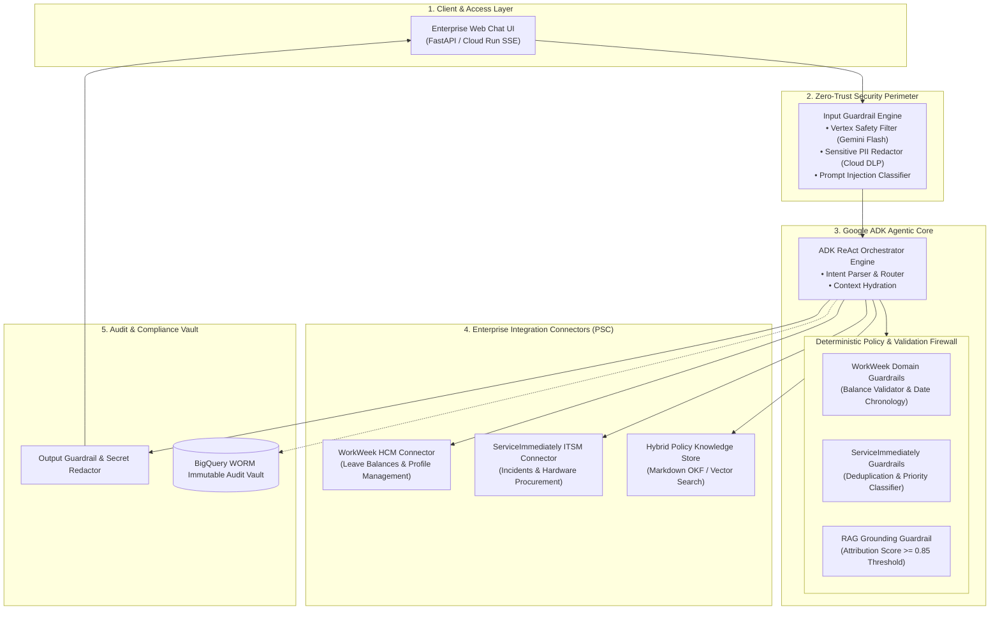

# Enterprise HR & Workplace Agentic Assistant (MVP 1)

[](https://cloud.google.com/)
[](https://adk.dev/)
[](https://cloud.google.com/vertex-ai)
[](https://cloud.google.com/security)

An enterprise-grade, cost-optimized, and secure Human Resources Virtual Assistant built with the **Google Agent Development Kit (ADK)**, **Gemini Foundation Models**, and **GCP-native Serverless Architecture**, implementing all technical specifications defined in `Consolidated_SDD.md`.

---

## 🏛️ System Architecture



---

## 🎯 Supported Use Cases

| ID | Category | Flow Description | Target Systems |
|---|---|---|---|
| **UC-1.1** | **Policy Q&A with Citations** | Answers employee handbook queries with strict grounding ($>0.85$) and deep links. Refuses ungrounded questions. | Policy Knowledge Base |
| **UC-1.2** | **HR Self-Service** | Checks accrued/remaining leave balances and submits vacation/sick requests with chronology & balance validation. | WorkWeek HCM |
| **UC-1.3** | **IT Incident Management** | Creates support tickets with automated categorization, priority mapping, and duplicate detection (<24h). | ServiceImmediately ITSM |
| **UC-2.1** | **Equipment Procurement** | Cross-system workflow: verifies policy eligibility, validates remote work profile in HCM, and creates hardware procurement ticket. | Policy RAG $\rightarrow$ WorkWeek $\rightarrow$ ServiceImmediately |
| **UC-2.2** | **Medical Leave & IT Routing** | Cross-system workflow: logs medical leave in WorkWeek and automatically opens an IT/HRSD access coverage ticket. | WorkWeek $\rightarrow$ ServiceImmediately |
| **UC-2.3** | **Relocation Support** | Cross-system workflow: updates residential address in HCM profile and opens a Facilities badge ticket. | WorkWeek $\rightarrow$ ServiceImmediately |

---

## 📁 Repository Structure

```
module3/
├── app/
│   ├── agent/                 # Google ADK agent, system prompt, tool definitions, orchestrator
│   │   ├── agent.py           # Exported root_agent (ADK)
│   │   ├── orchestrator.py    # ReAct execution loop & safety pipeline
│   │   ├── prompt.py          # System instructions & persona
│   │   └── tools.py           # 12 typed ADK tools with guardrails
│   ├── api/                   # Web Chat UI & FastAPI server
│   │   ├── server.py          # REST & SSE streaming endpoints
│   │   └── static/index.html  # Responsive chat interface with quick scenario pills
│   ├── audit/                 # BigQuery WORM audit logger
│   │   └── audit_vault.py     # Immutable JSONL / BigQuery audit writer
│   ├── connectors/            # Enterprise integration wrappers
│   │   ├── workweek_connector.py
│   │   └── service_immediately_connector.py
│   ├── guardrails/            # Deterministic validation engine
│   │   ├── input_safety.py    # Prompt injection & SPII masking
│   │   ├── output_safety.py   # Secret leak redaction
│   │   ├── rag_guard.py       # Grounding attribution threshold (>=0.85)
│   │   ├── service_immediately_guard.py # Deduplication & priority check
│   │   └── workweek_guard.py  # Balance & date chronology check
│   ├── models/                # Pydantic schemas (Session, WorkWeek, ITSM, RAG, Audit)
│   └── services/              # In-memory mock enterprise databases & OKF retriever
├── evals/                     # Quality evaluation benchmark
│   ├── golden_dataset.json    # Stratified test scenarios
│   └── run_eval.py            # Automated eval runner
├── knowledge/                 # Altostrat Singapore Employee Handbook (Markdown OKF)
├── tests/                     # Automated test suites
│   ├── test_use_cases.py      # Tests for all 6 use cases
│   └── test_guardrails.py     # Tests for security, injection, deduplication, balances
├── main.py                    # Multi-mode CLI, Server & Runner entrypoint
├── pyproject.toml             # Dependencies & packaging
└── .env                       # Environment configuration
```

---

## 🚀 Quick Start Guide

### 1. Run Automated Test Suite
```bash
python main.py test
# or
pytest -v tests/
```

### 2. Run Evaluation Benchmark
```bash
python evals/run_eval.py
```

### 3. Start Interactive CLI Chat
```bash
python main.py cli
```

### 4. Launch Web Chat UI & Server
```bash
python main.py server --port 8080
```
Open **[http://ssalimath.c.googlers.com:8080](http://ssalimath.c.googlers.com:8080)** in your browser to interact with the assistant and test all scenarios with one-click pills!

---

## 🛡️ Security & Zero-Trust Features
* **Prompt Injection Defense:** Blocks jailbreaks and unauthorized instruction overrides.
* **SPII Redaction:** Emulates Google Cloud DLP InfoTypes (US SSN, Singapore NRIC, Passwords, Credit Cards).
* **Payload Authorization Firewall:** Verifies session identity against target entity parameters.
* **WORM Audit Logging:** Immutable audit records matching BigQuery schema with user pseudonymization (SHA-256).
