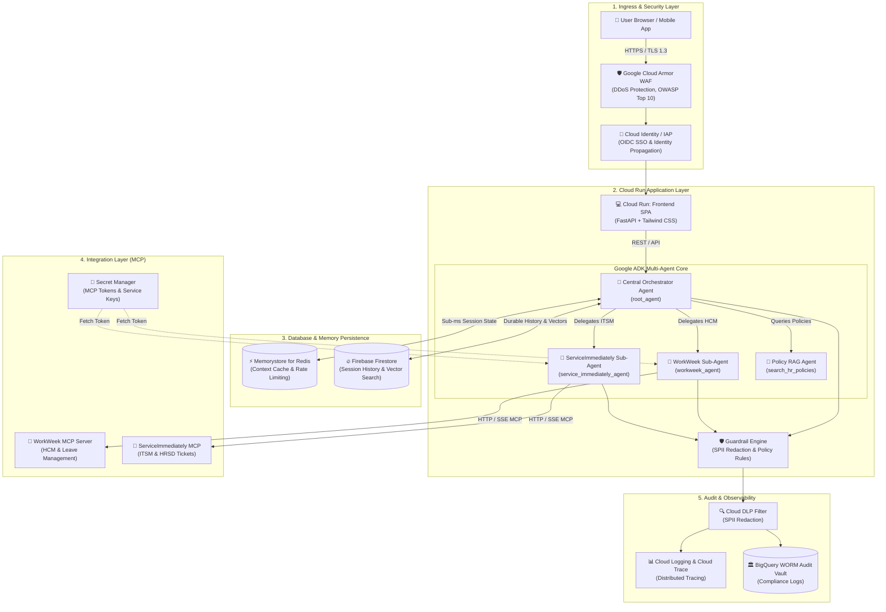
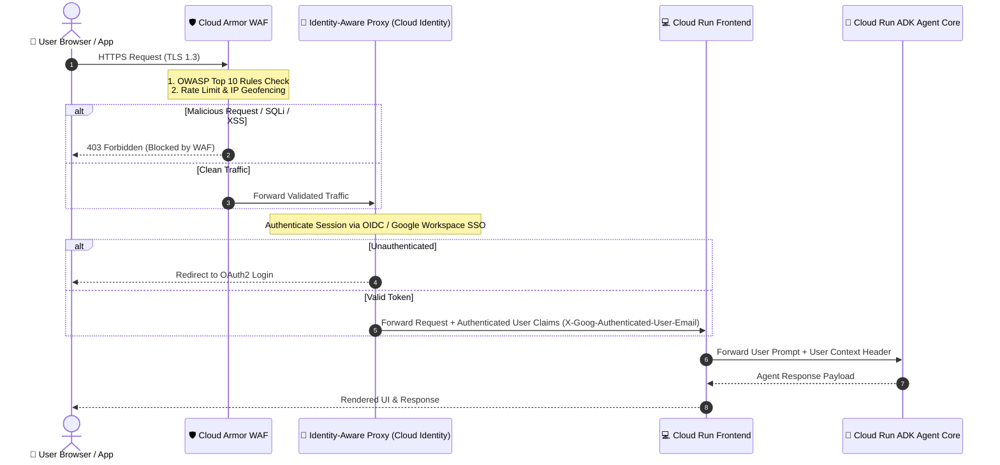
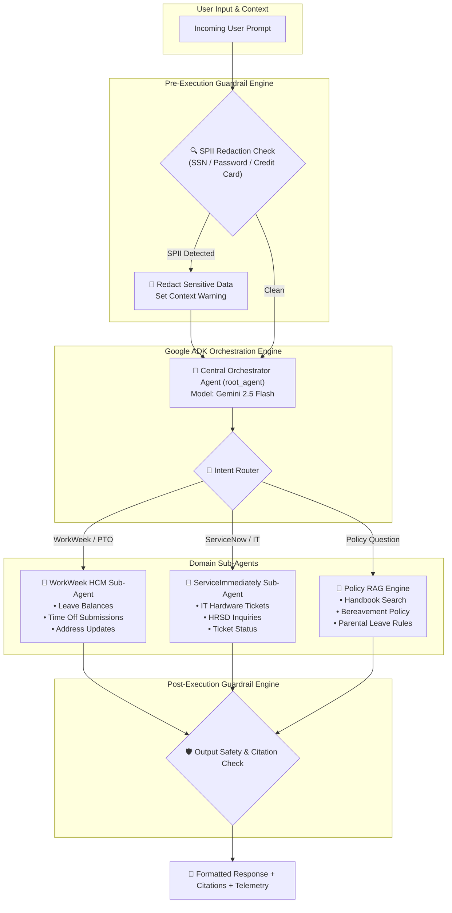
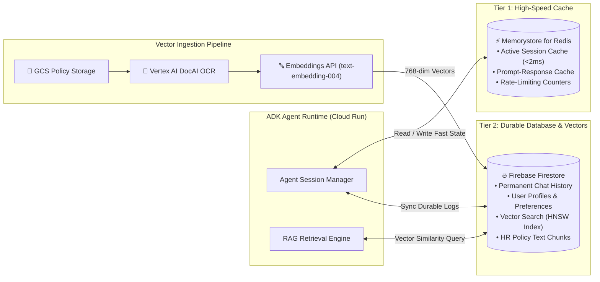
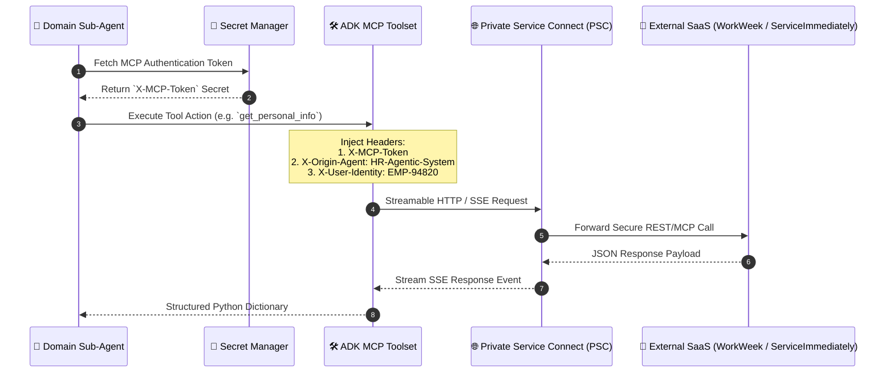
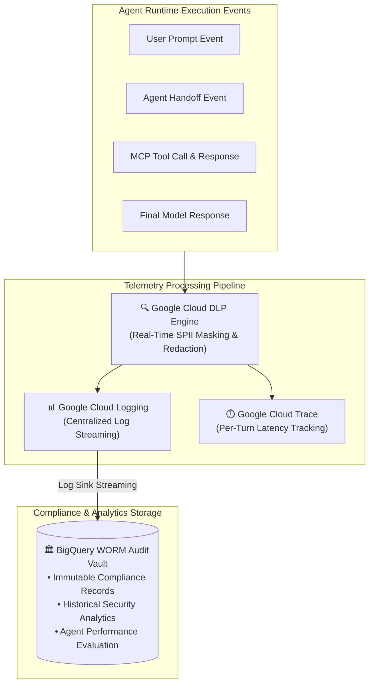

# 🏛️ Enterprise HR Virtual Assistant - Target Architecture Specification & Diagram Breakdown

> **Slide Deck & Technical Reference Guide**
> This document provides an executive summary and deep-dive architecture diagrams for each component of the production system on Google Cloud Platform (GCP).

---

## 📌 Section 1: Executive Overview & High-Level Architecture

### 1.1 Overview Slide: End-to-End Enterprise Architecture

The target architecture is a serverless, multi-agent enterprise HR assistant deployed on GCP. It combines WAF security, serverless container hosting on Cloud Run, Google Agent Development Kit (ADK) orchestration, dual-tier persistence (Firebase Firestore & Memorystore Redis), and enterprise tool connectors (WorkWeek HCM & ServiceImmediately ITSM).

### 1.2 Subsystem Summary Matrix

| Subsystem | GCP Service | Enterprise Functionality | SLA / Target |
| :--- | :--- | :--- | :--- |
| **Ingress & WAF** | Cloud Armor + IAP | Web application firewall, DDoS protection, OIDC SSO authentication | 99.99% Availability |
| **Frontend UI** | Cloud Run | Hosts responsive HTML5/Tailwind SPA with real-time telemetry drawer | < 50ms TTFB |
| **Multi-Agent Core** | Cloud Run (Google ADK) | Central Orchestrator delegating to specialized domain sub-agents | < 1.5s Response Latency |
| **Session Cache** | Memorystore for Redis | Sub-millisecond conversation state caching and token rate-limiting | < 2ms Latency |
| **Database & Vectors** | Firebase Firestore | Durable chat history, user profiles, and vector similarity search | 99.999% Availability |
| **Tool Connectors** | Remote MCP Servers | Standardized Model Context Protocol toolsets over Private Service Connect | High Resiliency |
| **Observability** | Cloud Logging & Trace | Centralized logging, distributed tracing, and Cloud DLP SPII filtering | Immutable Audit |

---

## 🛡️ Section 2: Ingress, WAF & Security Layer Deep-Dive

### 2.1 Slide Topic: Ingress Architecture & Zero-Trust Boundary

The Security Layer guarantees that all incoming HTTP traffic is filtered through Cloud Armor WAF rules before hitting identity-aware authentication proxy services.

### 2.2 Security Controls Summary
* **Cloud Armor WAF**: Filters layer 7 attacks, cross-site scripting (XSS), SQL injection (SQLi), and automated bot traffic.
* **Identity-Aware Proxy (IAP)**: Enforces Zero-Trust access based on user identity and context without requiring a traditional VPN.
* **Header Propagation**: Securely injects validated user identities (`X-Goog-Authenticated-User-Email`, `X-Goog-Authenticated-User-Id`) into the ADK runtime.

---

## 🤖 Section 3: Multi-Agent ADK Core & Guardrails Engine Deep-Dive

### 3.1 Slide Topic: Agentic Routing & Deterministic Guardrails

The application core utilizes the **Google Agent Development Kit (ADK)** to establish a hierarchical multi-agent structure. The Central Orchestrator evaluates user intent and routes requests to specialized domain sub-agents or policy RAG functions.

### 3.2 Key Multi-Agent Capabilities
* **Central Orchestrator (`root_agent`)**: Analyzes intent and delegates to sub-agents via ADK `sub_agents` mechanisms.
* **WorkWeek Sub-Agent (`workweek_agent`)**: Manages HCM operations, balance verifications, and profile address changes.
* **ServiceImmediately Sub-Agent (`service_immediately_agent`)**: Manages IT/HRSD ticket lifecycle, automatic assignment routing (e.g. `HR-Tier2-Ops`), and status checks.
* **Pre-Execution Guardrails (`spii_redaction_callback`)**: Guarantees sensitive data is scrubbed before LLM processing.

---

## 💾 Section 4: Database, RAG & Session Persistence Deep-Dive

### 4.1 Slide Topic: Dual-Tier Storage Architecture

To achieve sub-50ms session retrievals while supporting rich vector similarity searches, the architecture pairs **Memorystore for Redis** (fast cache) with **Firebase Firestore** (durable database and vector index).

### 4.2 Storage Strategy
* **Memorystore for Redis**: Stores active session state, immediate context turns, and rate-limiting keys with sub-2ms latency.
* **Firebase Firestore**: Stores long-term chat history, user metadata, and policy vector embeddings using native Firestore Vector Search (HNSW index).

---

## 🔌 Section 5: Integration & Remote MCP Layer Deep-Dive

### 5.1 Slide Topic: Model Context Protocol (MCP) Integration Sequence

Integration with downstream enterprise SaaS applications (WorkWeek HCM and ServiceImmediately ITSM) is standardizing on the **Model Context Protocol (MCP)** using Streamable HTTP/SSE transports.

### 5.2 MCP Architectural Benefits
* **Standardized Protocol**: Decouples agent logic from API client implementations.
* **Secret Management**: Credentials are stored in Google Cloud Secret Manager and injected at execution time.
* **Network Isolation**: Encapsulated via GCP Private Service Connect (PSC) to keep API traffic off the public internet.

---

## 📊 Section 6: Observability, Cloud Logging & Audit Telemetry Deep-Dive

### 6.1 Slide Topic: End-to-End Telemetry & Immutable Audit Vault

All prompt transactions, sub-agent handoffs, tool calls, and model outputs are streamed to **Cloud Logging** and **Cloud Trace**, with SPII filtered via **Cloud DLP**, before being archived into a **BigQuery WORM (Write Once Read Many) Audit Vault**.

### 6.2 Compliance & Observability Features
* **Cloud DLP Redaction**: Scans all log streams to redact Social Security Numbers (SSNs), passwords, and credit card details before writing to disk.
* **Cloud Trace**: Tracks multi-agent delegation latencies, tool execution times, and LLM generation durations.
* **BigQuery WORM Vault**: Ensures immutable, audit-ready storage for enterprise compliance and security analysis.
