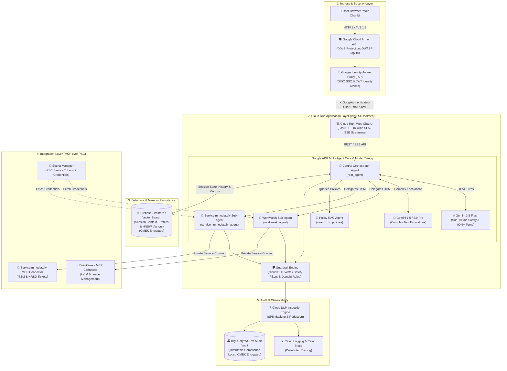
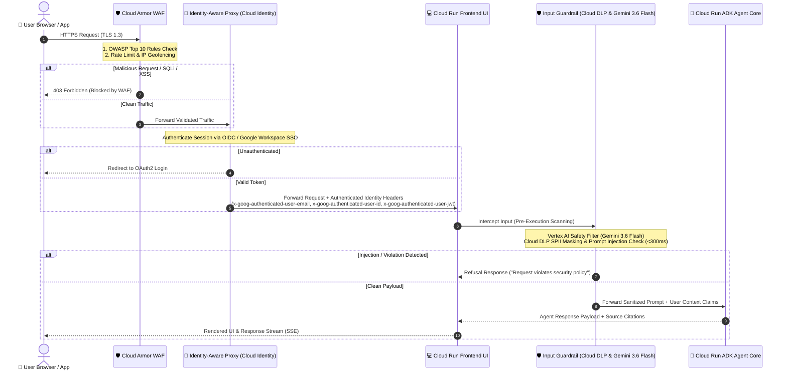
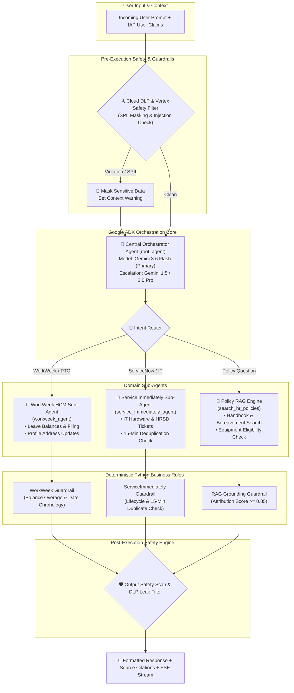
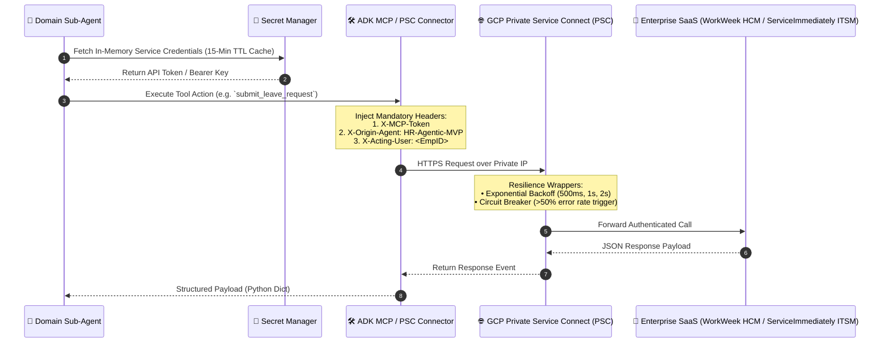
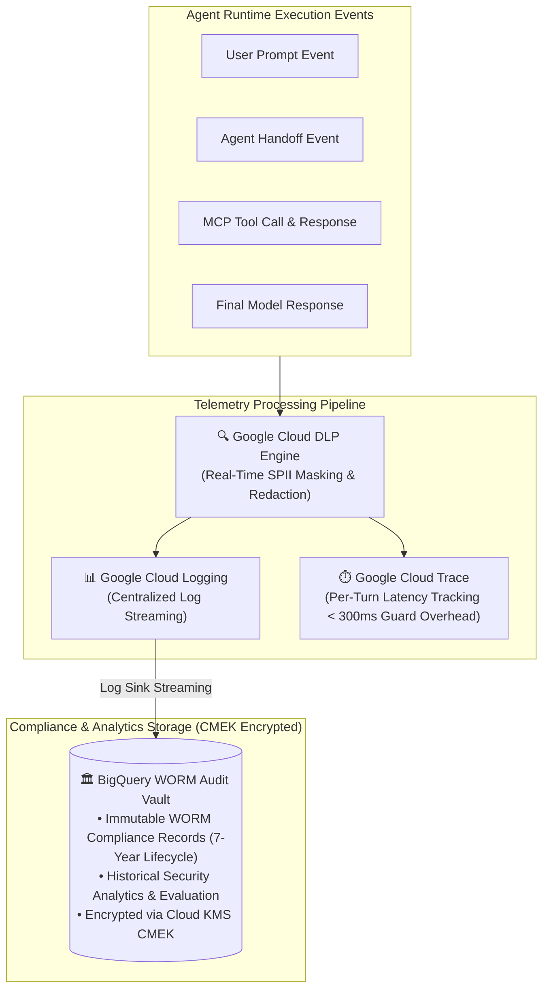

# 🏛️ Enterprise HR Virtual Assistant - Target Architecture Specification & Diagram Breakdown

> **Slide Deck & Technical Reference Guide**
> This document provides an executive summary and deep-dive architecture diagrams for each component of the production system on Google Cloud Platform (GCP).

---

## 📌 Section 1: Executive Overview & High-Level Architecture

### 1.1 Overview Slide: End-to-End Enterprise Architecture

The target architecture is a 100% GCP-native, cost-optimized serverless multi-agent enterprise HR assistant. It combines Cloud Armor WAF security, serverless container hosting on Cloud Run, Google Agent Development Kit (ADK) orchestration with cost-optimized model tiering (**Gemini 3.6 Flash** primary & **Gemini 1.5 / 2.0 Pro** escalation), unified serverless persistence (Firebase Firestore), and enterprise tool connectors (WorkWeek HCM & ServiceImmediately ITSM/HRSD) over Private Service Connect (PSC).



### 1.2 Subsystem Summary Matrix

| Subsystem | GCP Service | Enterprise Functionality | SLA / Target |
| :--- | :--- | :--- | :--- |
| **Ingress & WAF** | Cloud Armor + IAP | Web application firewall, DDoS protection, OIDC SSO authentication & JWT claim extraction | 99.99% Availability |
| **Frontend UI** | Cloud Run | Hosts responsive HTML5/Tailwind SPA with real-time SSE token streaming | < 50ms TTFB |
| **Multi-Agent Core** | Cloud Run (Google ADK) | Central Orchestrator delegating to sub-agents via Gemini 3.6 Flash (90%+ queries) & Gemini 1.5/2.0 Pro (escalations) | < 1.5s Latency (p95 total < 10.0s) |
| **Database, Session & Vectors** | Firebase Firestore | Serverless storage for 30-min idle TTL session state, chat history, user profiles, and vector search (HNSW index) | 99.999% Availability ($0 idle cost) |
| **Tool Connectors** | Remote MCP / PSC Connectors | Standardized toolsets over Private Service Connect with Secret Manager credentials & `X-Origin-Agent` headers | High Resiliency (Circuit Breakers) |
| **Observability & Audit** | Cloud Logging, Trace & BigQuery | Centralized logging, distributed tracing, Cloud DLP SPII redaction, and BigQuery WORM audit vault with CMEK | Immutable WORM Audit |

---

## 🛡️ Section 2: Ingress, WAF & Security Layer Deep-Dive

### 2.1 Slide Topic: Ingress Architecture & Zero-Trust Boundary

The Security Layer guarantees that all incoming HTTP traffic is filtered through Cloud Armor WAF rules and Google Identity-Aware Proxy (IAP) before passing through input safety filters prior to ADK execution.



### 2.2 Security Controls Summary
* **Cloud Armor WAF**: Filters Layer 7 attacks, cross-site scripting (XSS), SQL injection (SQLi), and automated bot traffic.
* **Identity-Aware Proxy (IAP)**: Enforces Zero-Trust access based on user identity, injecting cryptographically signed headers (`x-goog-authenticated-user-email`, `x-goog-authenticated-user-id`, `x-goog-authenticated-user-jwt`).
* **Input Safety Interceptor**: Scans inputs using **Gemini 3.6 Flash** and **Google Cloud DLP** to scrub SPII and block prompt injections in $<300\text{ ms}$ (p95).
* **Payload Authorization Firewall**: Cross-checks target payload employee ID against verified IAP session claims (`validate_user_authorization`) before tool invocation to prevent lateral privilege escalation.
* **Credential Architecture & Phase 2 Migration**: MVP 1 mounts functional service credentials from Secret Manager over Private Service Connect (PSC); Phase 2 transitions to zero-trust **OAuth 2.0 Token Exchange (`RFC 8693`)** via GCP Workload Identity Federation.

---

## 🤖 Section 3: Multi-Agent ADK Core & Guardrails Engine Deep-Dive

### 3.1 Slide Topic: Agentic Routing & Deterministic Guardrails

The application core utilizes the **Google Agent Development Kit (ADK)** to establish a hierarchical multi-agent structure. The Central Orchestrator evaluates user intent and routes requests to specialized domain sub-agents or policy RAG functions, leveraging **Gemini 3.6 Flash** for fast routing (90%+ queries) and escalating to **Gemini 1.5 / 2.0 Pro** for complex multi-system transaction planning.



### 3.2 Key Multi-Agent & Guardrail Capabilities
* **Central Orchestrator (`root_agent`)**: Executes a Plan-Validate-Execute-Verify ReAct loop. Uses **Gemini 3.6 Flash** ($0.075/1\text{M}$ input tokens) for sub-100ms routing and RAG synthesis on 90%+ of turns; escalates to **Gemini 1.5 / 2.0 Pro** for multi-system transaction planning (e.g. UC-2.1, UC-2.2).
* **WorkWeek Sub-Agent (`workweek_agent`)**: Manages HCM leave balances and profile updates; bound by a deterministic **WorkWeek Guardrail** verifying chronological date sanity and ensuring requested leave hours $\le$ available accrued balance.
* **ServiceImmediately Sub-Agent (`service_immediately_agent`)**: Manages IT/HRSD tickets and auto-assignment (e.g. `HR-Tier2-Ops`); bound by a **ServiceImmediately Guardrail** checking for duplicate tickets created within a 15-minute window.
* **Policy RAG Agent (`search_hr_policies`)**: Queries policy embeddings; bound by a **RAG Grounding Guardrail** asserting an attribution score $\ge 0.85$. If ungrounded, outputs a deterministic refusal rather than hallucinating.
* **Pre/Post-Execution Guardrails**: Cloud DLP SPII redaction callbacks (`spii_redaction_callback`) scrub sensitive identifiers before and after LLM inference.

---

## 💾 Section 4: Database, RAG & Session Persistence Deep-Dive

### 4.1 Slide Topic: Serverless Unified Storage Architecture (Firebase Firestore / Cloud SQL pgvector)

To simplify operations, eliminate dedicated cache cluster overhead, and support serverless auto-scaling, the architecture uses **Firebase Firestore** (or **Cloud SQL pgvector**) as a serverless persistence engine for session state management, conversation history, user profiles, and vector similarity search—all encrypted at rest using **Google Cloud KMS Customer-Managed Encryption Keys (CMEK)**.

```mermaid
flowchart LR
    subgraph ADKRuntime ["ADK Agent Runtime (Cloud Run)"]
        AgentSession["Agent Session Manager\n(FirestoreSessionStore / 30-Min Idle TTL)"]
        RAGRetriever["RAG Retrieval Engine\n(Hybrid Dense + BM25 Lexical)"]
    end

    subgraph UnifiedStorage ["Serverless Persistence (CMEK Encrypted)"]
        Firestore[("🔥 Firebase Firestore / Cloud SQL pgvector\n• Active Session State (30-Min Idle TTL, $0 Idle Cost)\n• Permanent Conversation History Logs\n• User Profiles & Authorization Mapping\n• HR Policy Text Chunks (~1,500 Chunks)\n• Native HNSW Vector Index (m=16, ef_search=40)")]
    end

    subgraph IngestionPipeline ["Vector Ingestion Pipeline"]
        DocStorage["📄 GCS Policy Bucket"]
        DocAI["📑 Vertex AI Document AI (OCR & Chunking)"]
        EmbeddingsAPI["🔤 Vertex AI Embeddings API (text-embedding-004)"]
    end

    AgentSession <-->|Session State & History Read/Write| Firestore
    DocStorage --> DocAI --> EmbeddingsAPI -->|768-dim Vectors| Firestore
    RAGRetriever <-->|Vector Similarity Query (Recall >= 0.95)| Firestore
```

### 4.2 Storage Strategy
* **Firebase Firestore / Cloud SQL pgvector**: Serves as the serverless persistence layer for the entire system:
  * **Session & Conversation State**: Persists ADK agent session turns and multi-agent context with a 30-minute idle TTL and zero idle container cost.
  * **User Metadata**: Stores employee profile mappings, preference configurations, and security scope definitions.
  * **Vector Search (HNSW Index)**: Stores 768-dimensional embeddings (`text-embedding-004`) with native HNSW indexing (`m = 16`, `ef_construction = 64`, `ef_search = 40`) and hybrid dense + BM25 keyword matching for ~1,500 policy text chunks.
  * **CMEK Encryption**: Encrypted at rest via Google Cloud KMS Customer-Managed Encryption Keys.

---

## 🔌 Section 5: Integration & Remote MCP Layer Deep-Dive

### 5.1 Slide Topic: Model Context Protocol (MCP) & PSC Integration Sequence

Integration with downstream enterprise SaaS applications (WorkWeek HCM and ServiceImmediately ITSM/HRSD) relies on standardized **Model Context Protocol (MCP)** tool connectors communicating securely over **GCP Private Service Connect (PSC)** with VPC Service Control (VPC-SC) perimeters.



### 5.2 MCP & PSC Architectural Benefits
* **Standardized Protocol**: Decouples agent reasoning logic from API client implementations.
* **Secret Management & Isolation**: Credentials are stored in Google Cloud Secret Manager, cached in-memory for 15 minutes, and injected at execution time.
* **Network Isolation & Provenance**: Egress is restricted to Private Service Connect (PSC) with mandatory custom headers (`X-Origin-Agent: HR-Agentic-MVP`, `X-Acting-User: <EmpID>`) for full auditability.

---

## 📊 Section 6: Observability, Cloud Logging & Audit Telemetry Deep-Dive

### 6.1 Slide Topic: End-to-End Telemetry & Immutable BigQuery WORM Audit Vault

All user prompts, sub-agent handoffs, tool calls, and model outputs are processed through **Google Cloud DLP** for real-time SPII masking before being published asynchronously to **Cloud Logging**, **Cloud Trace**, and a **Google Cloud BigQuery WORM (Write-Once-Read-Many) Audit Vault**.



### 6.2 Compliance & Observability Features
* **Cloud DLP Redaction**: Scans all log streams in real-time to redact SSNs, passwords, and credit card details before writing to disk.
* **Cloud Trace**: Tracks multi-agent delegation latencies, tool execution times, and LLM generation durations (target: $<300\text{ ms}$ p95 guardrail overhead, $<10.0\text{ s}$ p95 total turn latency).
* **BigQuery WORM Vault**: Enforces append-only WORM controls with a 7-year lifecycle and CMEK encryption for immutable enterprise audit compliance.
